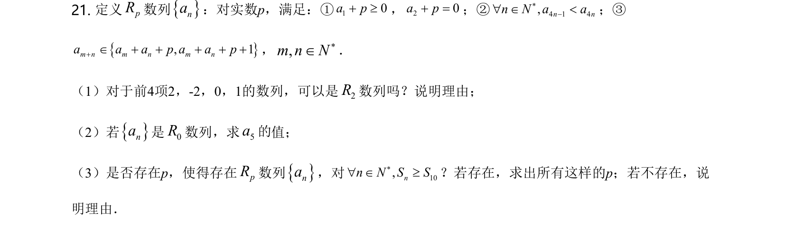
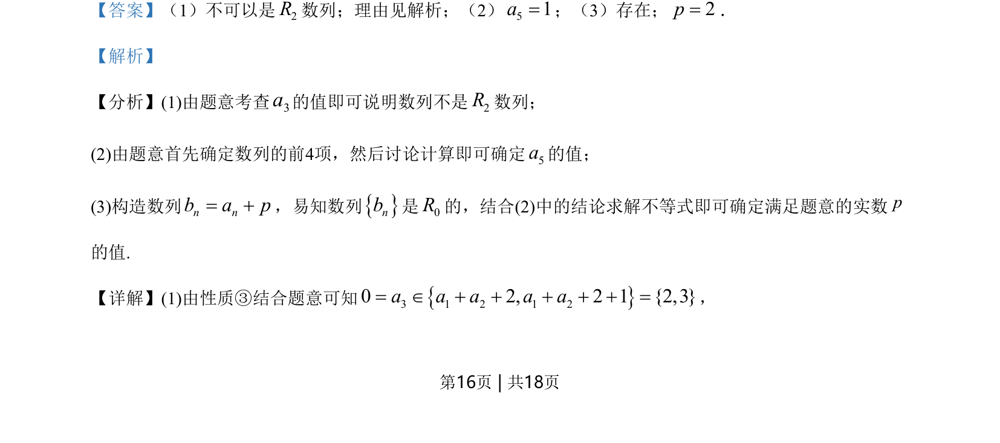
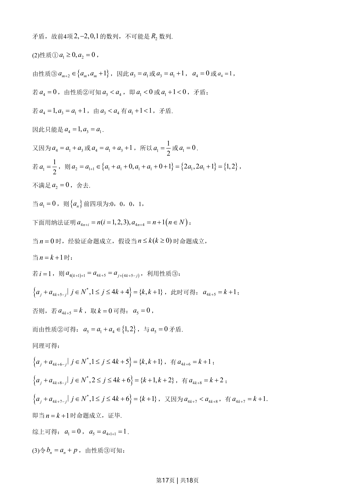
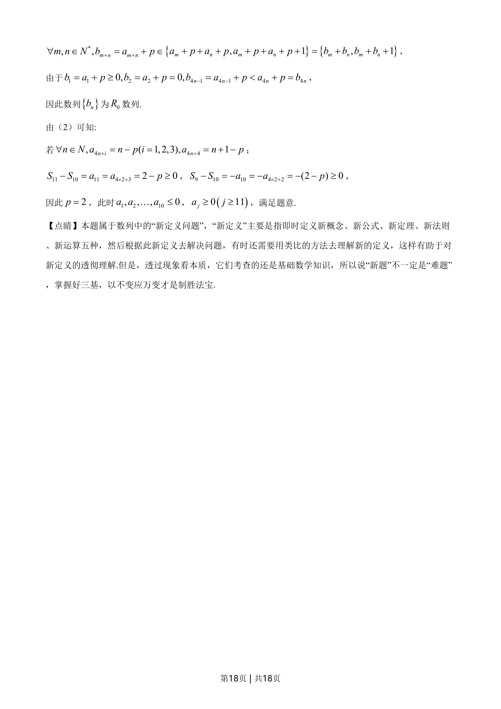

## 题面

## 摘要

本题通过新定义“R数列”的性质和递推关系，讨论数列是否为R数列、确定特定项及参数取值。

## 关联考点

- [[1381-数列新定义|数列新定义]]
- [[383-数列递推公式|递推关系]]
- [[386-数学归纳法-初步|数学归纳法]]
- [[424-参数分类讨论|分类讨论]]

## 答案与解析

> 📄 原 PDF 第 16 页：`素材/真题/北京/2008-2024·（北京）数学高考真题/2021年高考数学试卷（北京）（解析卷）.pdf`
