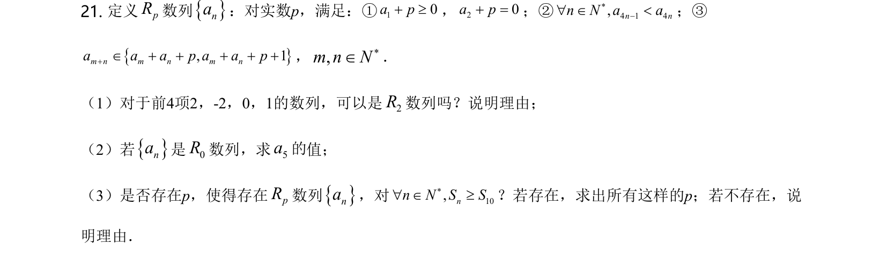
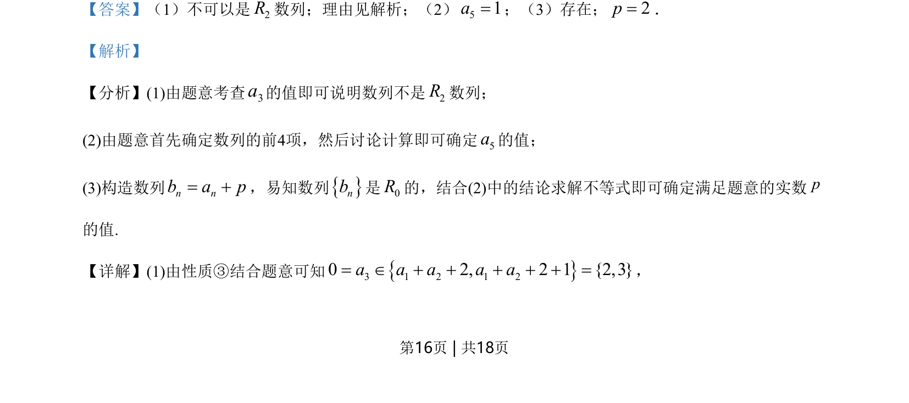
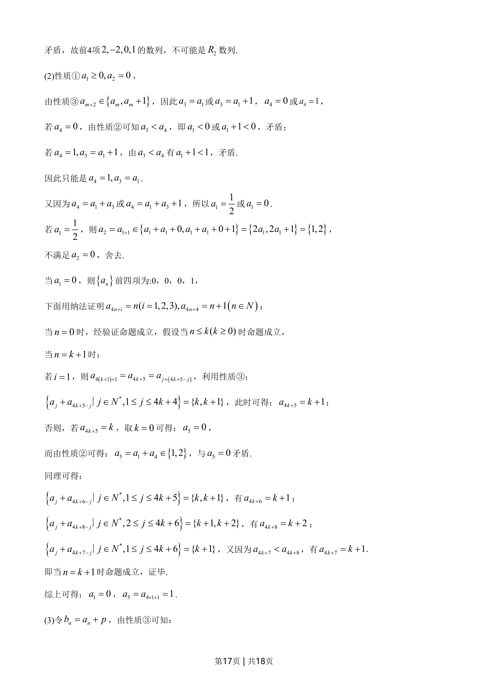
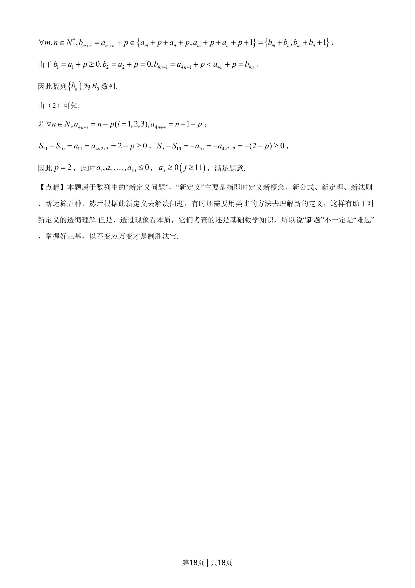

## 题面

## 摘要

本题通过新定义“R数列”的性质和递推关系，讨论数列是否为R数列、确定特定项及参数取值。

## 关联考点

- [[1381-数列新定义|数列新定义]]
- [[383-数列递推公式|递推关系]]
- [[386-数学归纳法-初步|数学归纳法]]
- [[424-参数分类讨论|分类讨论]]

## 答案与解析

> 📄 原 PDF 第 16 页：`素材/真题/北京/2008-2024·（北京）数学高考真题/2021年高考数学试卷（北京）（解析卷）.pdf`

<!-- 题干文本-start -->
## 题干文本
21. 定义pR数列na：对实数p，满足：①10ap+³，20ap+=；② 414,nnnNaa-<；③
,1mnmnmnaaapaap++++++，,m n N．
（1）对于前4项2，-2，0，1的数列，可以是2R数列吗？说明理由；
（2）若na是0R数列，求5a值；
（3）是否存在p，使得存在pR数列na，对 10,nnNSS³？若存在，求出所有这样的p；若不存在，说
明理由．
<!-- 题干文本-end -->

<!-- 解析文本-start -->
## 解析文本
【答案】（1）不可以是2R数列；理由见解析；（2）51a=；（3）存在；2p=．
【解析】
【分析】(1)由题意考查3a的值即可说明数列不是2R数列；
(2)由题意首先确定数列的前4项，然后讨论计算即可确定5a的值；
(3)构造数列n nb a p= +，易知数列nb是0R的，结合(2)中的结论求解不等式即可确定满足题意的实数p
的值.
【详解】(1)由性质③结合题意可知3 1 2 1 20 2, 2 1 {2,3}a a a a a=  + + + + + =，
.的
<!-- 解析文本-end -->
