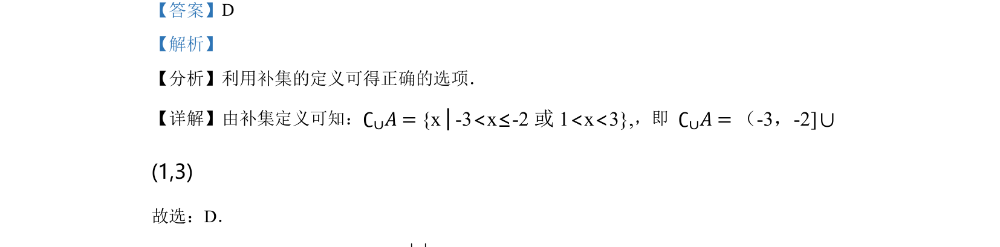

## 题面

## 摘要

利用补集定义求集合的补集，并用区间表示结果。

## 关联考点

- [[1101-补集|补集]]
- [[314-集合的运算|集合运算]]
- [[1371-区间表示|区间表示]]

## 答案与解析

> 📄 原 PDF 第 1 页：`素材/真题/北京/2008-2024·（北京）数学高考真题/2022年高考数学试卷（北京）（解析卷）.pdf`

<!-- 题干文本-start -->
## 题干文本
1. 已知全集{ 3 3}U x x= - < <，集合{ 2 1 }A x x= - < £，则∁∪𝐴 = （    ）
A. ( 2,1]-B. ( 3, 2) [1,3)- -UC. [2,1)-D. 
( 3, 2] (1,3)- -U
<!-- 题干文本-end -->

<!-- 解析文本-start -->
## 解析文本
【答案】D
【解析】
【分析】利用补集的定义可得正确的选项．
【详解】由补集定义可知：∁∪𝐴 = {x│-3<x≤-2 或 1<x<3},，即 ∁∪𝐴 =（-3，-2]∪
(1,3)
故选：D．
<!-- 解析文本-end -->
