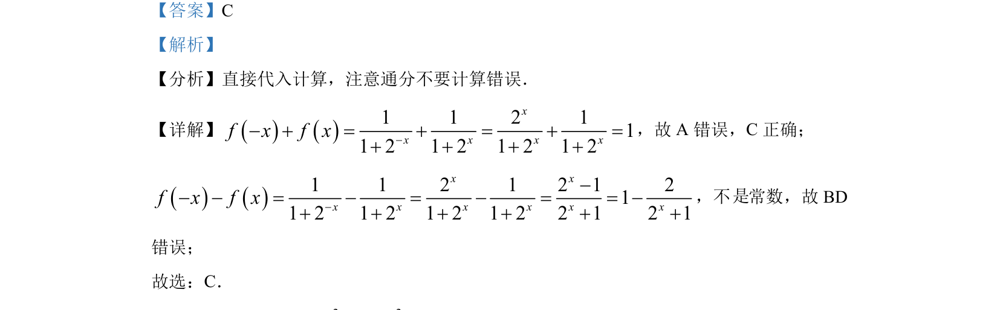

## 题面

## 摘要

考查函数值的代入计算与代数化简，通过求f(x)+f(-x)和f(x)-f(-x)判断选项。

## 关联考点

- [[684-函数求值|函数求值]]
- [[1368-代数化简|代数化简]]
- [[817-奇偶性|奇偶性]]

## 答案与解析

> 📄 原 PDF 第 2 页：`素材/真题/北京/2008-2024·（北京）数学高考真题/2022年高考数学试卷（北京）（解析卷）.pdf`
