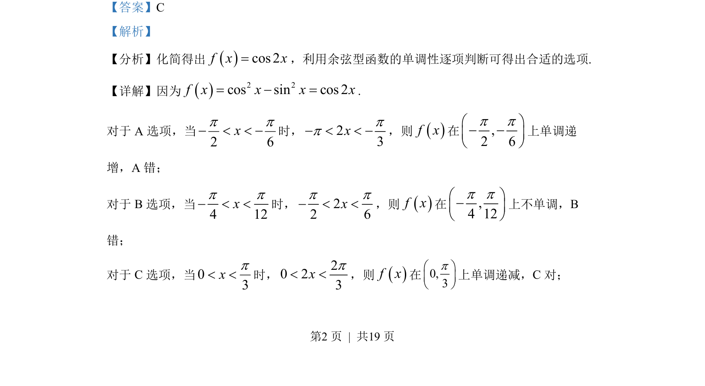
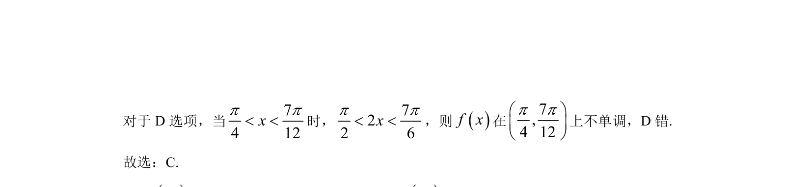

## 题面

## 摘要

考查余弦型函数单调性区间判断及等差数列递增与充分必要条件

## 关联考点

- [[余弦型函数单调性]]
- [[533-充分必要条件|充分必要条件]]
- [[等差数列单调性]]

## 答案与解析

> 📄 原 PDF 第 2 页：`素材/真题/北京/2008-2024·（北京）数学高考真题/2022年高考数学试卷（北京）（解析卷）.pdf`

<!-- 题干文本-start -->
## 题干文本
5. 已知函数 2 2( ) cos sinf x x x= -，则（    ）
A. ( )f x在,2 6p pæ ö- -ç ÷è ø
上单调递减B. ( )f x在,4 12p pæ ö-ç ÷è ø
上单调递增
C. ( )f x在0,3pæ öç ÷è ø上单调递减D. ( )f x在7,4 12p pæ öç ÷è ø
上单调递增
<!-- 题干文本-end -->

<!-- 解析文本-start -->
## 解析文本
【答案】C
【解析】
【分析】化简得出cos 2f x x=，利用余弦型函数的单调性逐项判断可得出合适的选项.
【详解】因为2 2cos sin cos 2f x x x x= - =.
对于 A 选项，当
2 6xp p- < < -时，23xpp- < < -，则f x在,2 6p pæ ö- -ç ÷è ø
上单调递
增，A 错；
对于 B选项，当
4 12xp p- < <时，22 6xp p- < <，则f x在,4 12p pæ ö-ç ÷è ø
上不单调，B
错；
对于 C选项，当03xp< <时，20 23xp< <，则f x在0,3pæ öç ÷è ø上单调递减，C对；
是
<!-- 解析文本-end -->
