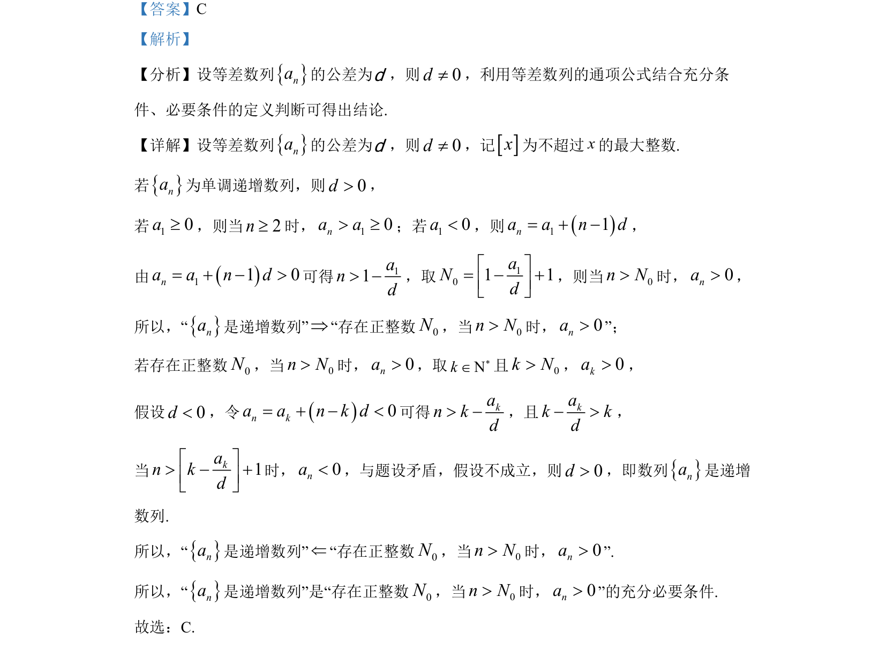

## 题面

## 摘要

判断等差数列递增与存在正整数使后项为正的充要条件。

## 关联考点

- [[356-等差数列概念|等差数列]]
- [[279-充要条件|充要条件]]
- [[递增数列]]
- [[存在命题]]

## 答案与解析

> 📄 原 PDF 第 3 页：`素材/真题/北京/2008-2024·（北京）数学高考真题/2022年高考数学试卷（北京）（解析卷）.pdf`
