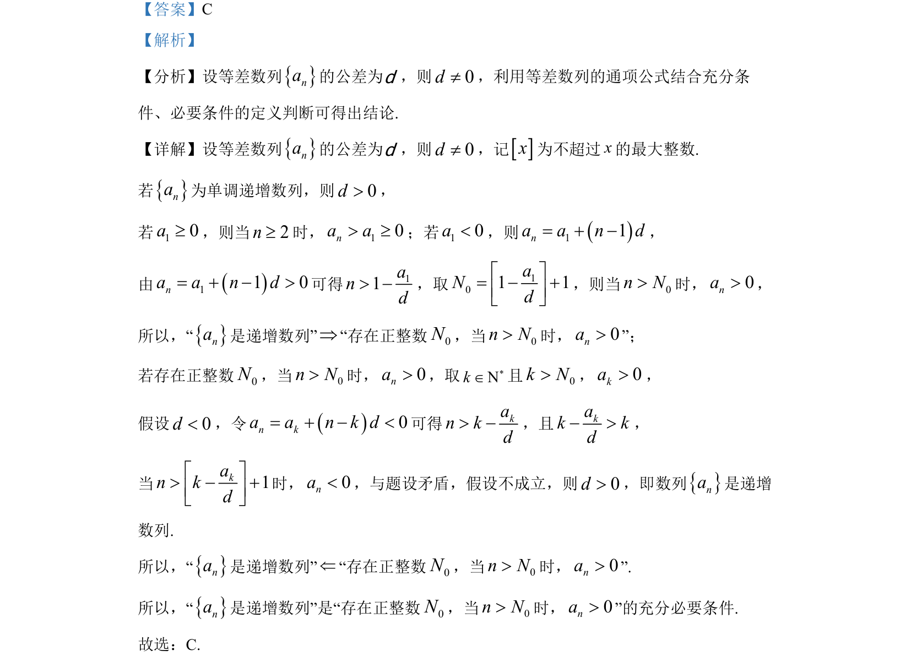

## 题面

## 摘要

判断等差数列递增与存在正整数使后项为正的充要条件。

## 关联考点

- [[356-等差数列概念|等差数列]]
- [[279-充要条件|充要条件]]
- [[递增数列]]
- [[存在命题]]

## 答案与解析

> 📄 原 PDF 第 3 页：`素材/真题/北京/2008-2024·（北京）数学高考真题/2022年高考数学试卷（北京）（解析卷）.pdf`

<!-- 题干文本-start -->
## 题干文本
6. 设na是公差不为 0 的无穷等差数列，则“na为递增数列”是“存在正整数0N，当
0n N>时，0na>”的（    ）
A. 充分而不必要条件 B. 必要而不充分条件
C. 充分必要条件 D. 既不充分也不必要条件
<!-- 题干文本-end -->

<!-- 解析文本-start -->
## 解析文本
【答案】C
【解析】
【分析】设等差数列na的公差为d，则0d¹，利用等差数列的通项公式结合充分条
件、必要条件的定义判断可得出结论.
【详解】设等差数列na的公差为d，则0d¹，记x为不超过x的最大整数.
若na为单调递增数列，则0d>，
若10a³，则当2n³时， 10na a> ³；若10a<，则11na a n d+ -=，
由11 0na a n d= + - >可得 11and> -，取 101 1aNdé ù= - +ê úë û
，则当 0n N>时，0na>，
所以，“na是递增数列”Þ“存在正整数0N，当 0n N>时，0na>”；
若存在正整数0N，当 0n N>时，0na>，取Nk*Î且 0k N>，0ka>，
假设0d<，令0n ka a n k d= + - <可得 kan kd> -，且kak kd- >，
当 1kan kdé ù> - +ê úë û
时，0na<，与题设矛盾，假设不成立，则0d>，即数列na是递增
数列.
所以，“na是递增数列”Ü“存在正整数0N，当 0n N>时，0na>”.
所以，“na是递增数列”是“存在正整数0N，当 0n N>时，0na>”的充分必要条件.
故选：C.
<!-- 解析文本-end -->
