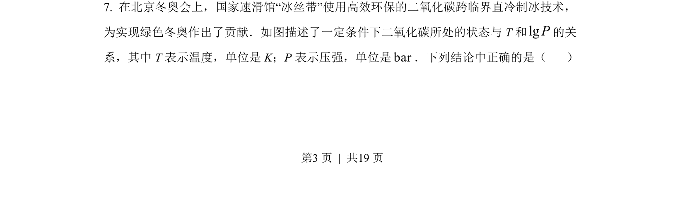
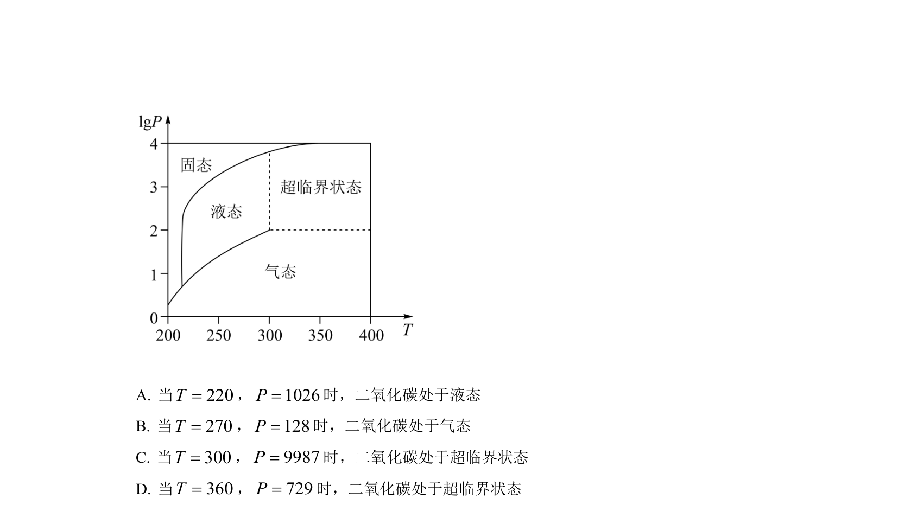
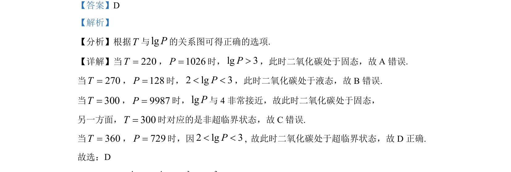

## 题面

## 摘要

根据温度与lgP关系图判断二氧化碳的固、液、超临界状态。

## 关联考点

- [[832-对数运算|对数运算]]
- [[函数图像应用]]
- [[物质状态判断]]

## 答案与解析

> 📄 原 PDF 第 3 页：`素材/真题/北京/2008-2024·（北京）数学高考真题/2022年高考数学试卷（北京）（解析卷）.pdf`

<!-- 题干文本-start -->
## 题干文本
7. 在北京冬奥会上，国家速滑馆“冰丝带”使用高效环保的二氧化碳跨临界直冷制冰技术，
为实现绿色冬奥作出了贡献．如图描述了一定条件下二氧化碳所处的状态与 T 和lgP的关
系，其中 T 表示温度，单位是 K；P表示压强，单位是bar．下列结论中正确的是（    ）
<!-- 题干文本-end -->

<!-- 解析文本-start -->
## 解析文本

<!-- 解析文本-end -->
