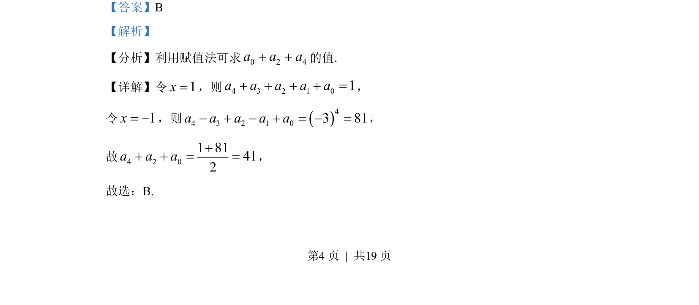

## 题面

## 摘要

正三棱锥（正四面体）底面内满足到顶点距离≤5的点集区域面积计算，涉及截面圆与三角形交叠。

## 关联考点

- [[1317-正三棱锥|正三棱锥]]
- [[点到定点的距离]]
- [[圆的面积]]
- [[交叠区域]]

## 答案与解析

> 📄 原 PDF 第 4 页：`素材/真题/北京/2008-2024·（北京）数学高考真题/2022年高考数学试卷（北京）（解析卷）.pdf`
