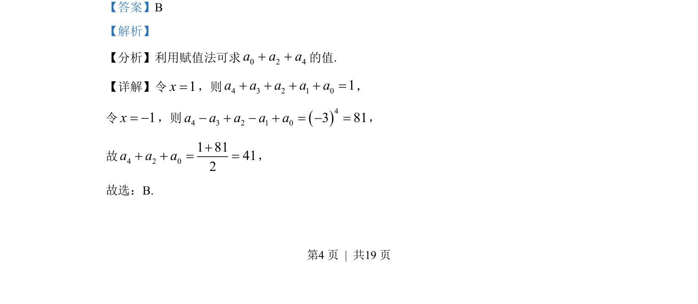

## 题面

## 摘要

正三棱锥（正四面体）底面内满足到顶点距离≤5的点集区域面积计算，涉及截面圆与三角形交叠。

## 关联考点

- [[1317-正三棱锥|正三棱锥]]
- [[点到定点的距离]]
- [[圆的面积]]
- [[交叠区域]]

## 答案与解析

> 📄 原 PDF 第 4 页：`素材/真题/北京/2008-2024·（北京）数学高考真题/2022年高考数学试卷（北京）（解析卷）.pdf`

<!-- 题干文本-start -->
## 题干文本
8. 若 4 4 3 24 3 2 1 0(2 1)x a x a x a x a x a- = + + + +，则0 2 4a a a+ + =（    ）
A. 40 B. 41 C. 40-D. 41-
<!-- 题干文本-end -->

<!-- 解析文本-start -->
## 解析文本
【答案】B
【解析】
【分析】利用赋值法可求0 2 4a a a++的值.
【详解】令1x=，则4 3 2 1 01a a a a a+ + + + =，
令1x= -，则 44 3 2 1 03 81a a a a a- + - + = - =，
故4 2 01 81412a a a++ + = =，
故选：B.
<!-- 解析文本-end -->
