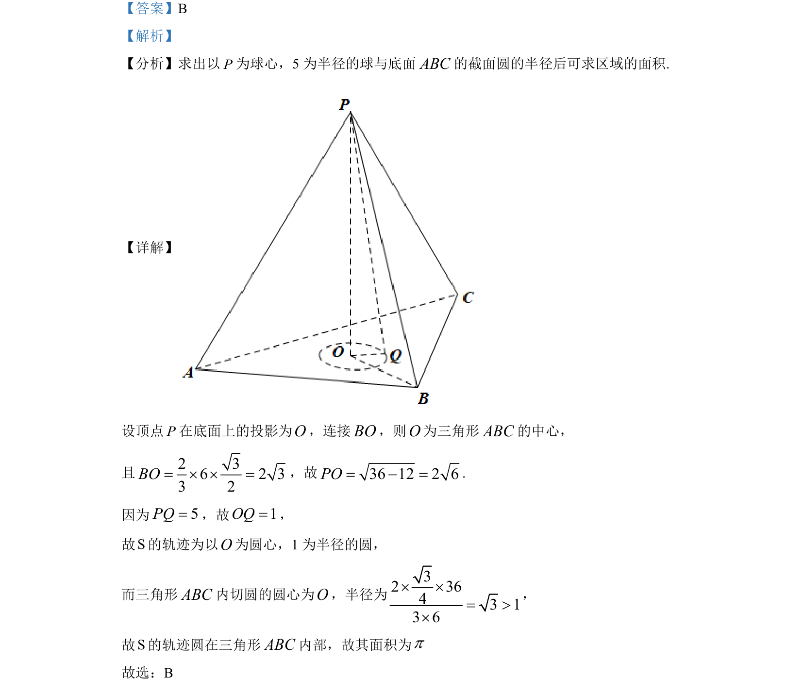

## 题面

## 摘要

该题考查球与底面的截面圆半径计算，进而确定动点轨迹区域面积。

## 关联考点

- [[球的截面圆]]
- [[354-空间距离|点面距离]]
- [[三角形中心]]

## 答案与解析

> 📄 原 PDF 第 5 页：`素材/真题/北京/2008-2024·（北京）数学高考真题/2022年高考数学试卷（北京）（解析卷）.pdf`

<!-- 题干文本-start -->
## 题干文本
9. 已知正三棱锥P ABC-的六条棱长均为 6，S 是ABCV及其内部的点构成的集合．设集
合5T Q S PQ= Î £，则 T 表示的区域的面积为（    ）
A. 34pB. pC. 2pD. 3p
<!-- 题干文本-end -->

<!-- 解析文本-start -->
## 解析文本
【答案】B
【解析】
【分析】求出以P为球心，5 为半径的球与底面ABC的截面圆的半径后可求区域的面积.
【详解】
设顶点P在底面上的投影为O，连接BO，则O为三角形ABC的中心，
且2 36 2 33 2BO= ´ ´ =，故36 12 2 6PO= - =.
因为5PQ=，故1OQ=，
故S的轨迹为以O为圆心，1 为半径的圆，
而三角形ABC内切圆的圆心为O，半径为
32 3643 13 6´ ´= >´
，
故S的轨迹圆在三角形ABC内部，故其面积为p
故选：B
<!-- 解析文本-end -->
