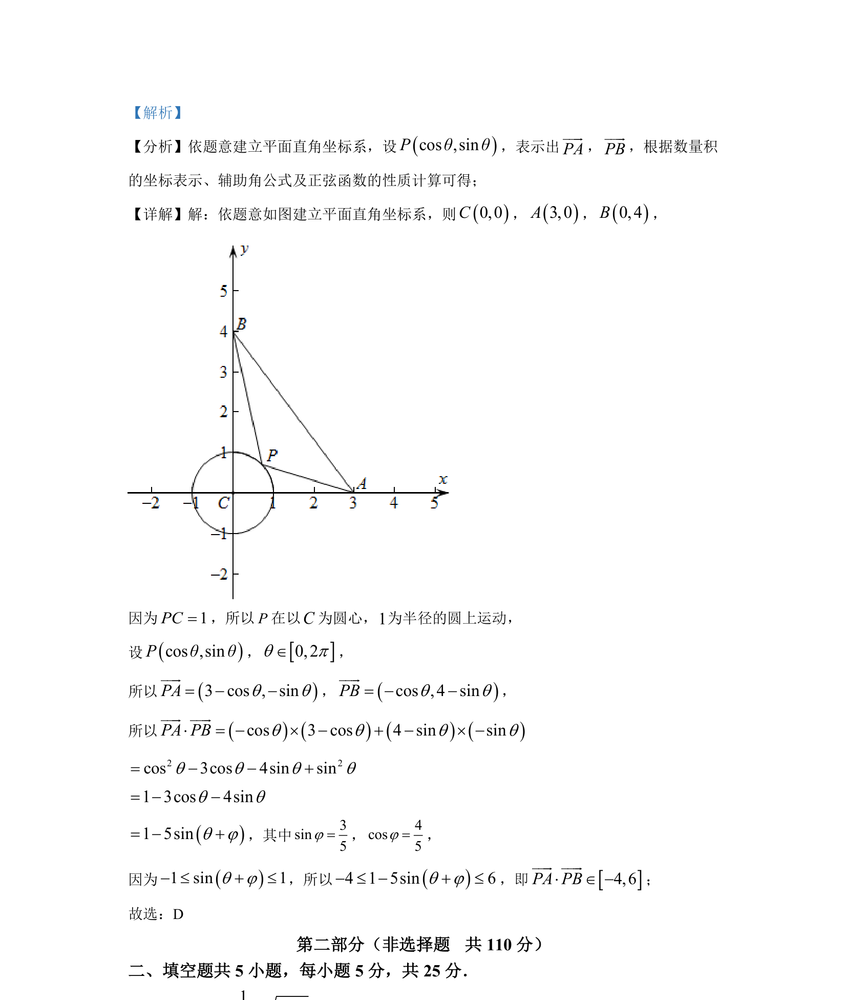

## 题面

## 摘要

通过建立坐标系，利用圆的参数方程和向量数量积，结合辅助角公式求取值范围。

## 关联考点

- [[854-平面向量数量积|平面向量数量积]]
- [[544-圆的参数方程|圆的参数方程]]
- [[1126-辅助角公式|辅助角公式]]
- [[959-正弦函数值域|正弦函数值域]]

## 答案与解析

> 📄 原 PDF 第 5 页：`素材/真题/北京/2008-2024·（北京）数学高考真题/2022年高考数学试卷（北京）（解析卷）.pdf`
