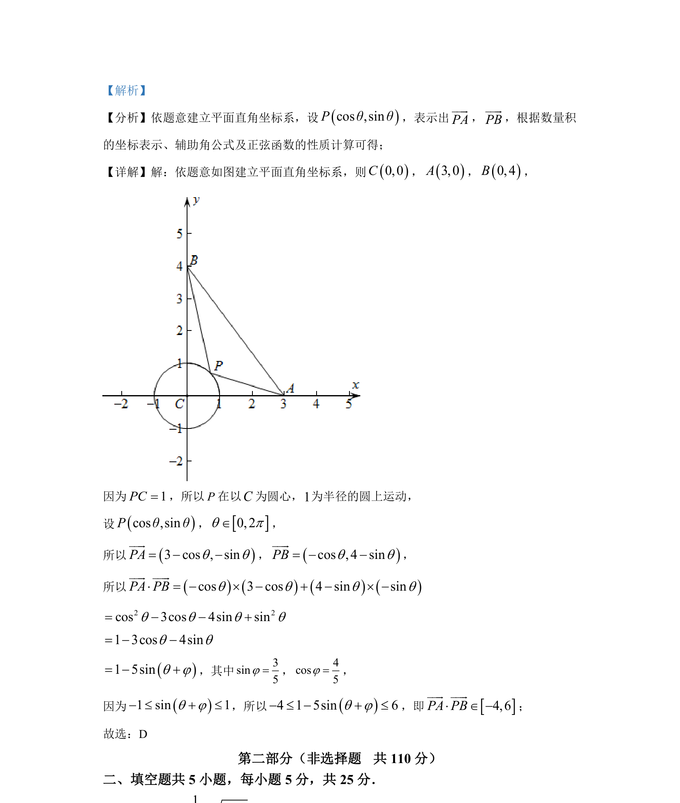

## 题面

## 摘要

通过建立坐标系，利用圆的参数方程和向量数量积，结合辅助角公式求取值范围。

## 关联考点

- [[854-平面向量数量积|平面向量数量积]]
- [[544-圆的参数方程|圆的参数方程]]
- [[1126-辅助角公式|辅助角公式]]
- [[959-正弦函数值域|正弦函数值域]]

## 答案与解析

> 📄 原 PDF 第 5 页：`素材/真题/北京/2008-2024·（北京）数学高考真题/2022年高考数学试卷（北京）（解析卷）.pdf`

<!-- 题干文本-start -->
## 题干文本
10. 在ABCV中，3, 4, 90AC BC C= = Ð = °．P为ABCV所在平面内的动点，且
1PC=，则PA PB×uuu r uuu r
的取值范围是（    ）
A. [ 5,3]-B. [ 3,5]-C. [ 6,4]-D. [ 4,6]-
<!-- 题干文本-end -->

<!-- 解析文本-start -->
## 解析文本
【答案】D
<!-- 解析文本-end -->
