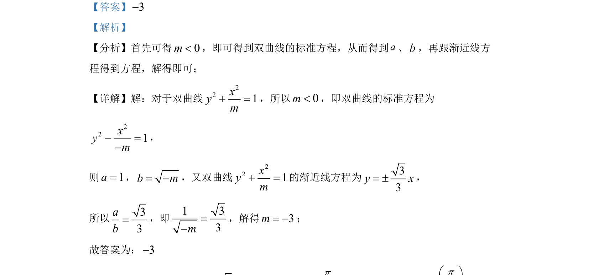

## 题面

## 摘要

根据双曲线渐近线方程求参数 m 的值。

## 关联考点

- [[732-双曲线的标准方程|双曲线的标准方程]]
- [[369-双曲线渐近线|渐近线]]
- [[725-参数求解|参数求解]]

## 答案与解析

> 📄 原 PDF 第 7 页：`素材/真题/北京/2008-2024·（北京）数学高考真题/2022年高考数学试卷（北京）（解析卷）.pdf`

<!-- 题干文本-start -->
## 题干文本
12. 已知双曲线
221xym+ =的渐近线方程为33y x= ±，则m=__________．
<!-- 题干文本-end -->

<!-- 解析文本-start -->
## 解析文本
【答案】3-
【解析】
【分析】首先可得0m<，即可得到双曲线的标准方程，从而得到a、b，再跟渐近线方
程得到方程，解得即可；
【详解】解：对于双曲线
221xym+ =，所以0m<，即双曲线的标准方程为
221xym- =-
，
则1a=，b m= -，又双曲线
221xym+ =的渐近线方程为33y x= ±，
所以33ab=，即1 33m=-
，解得3m= -；
故答案为：3-
<!-- 解析文本-end -->
