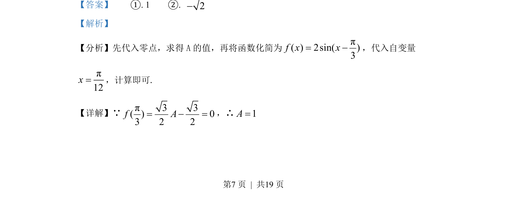
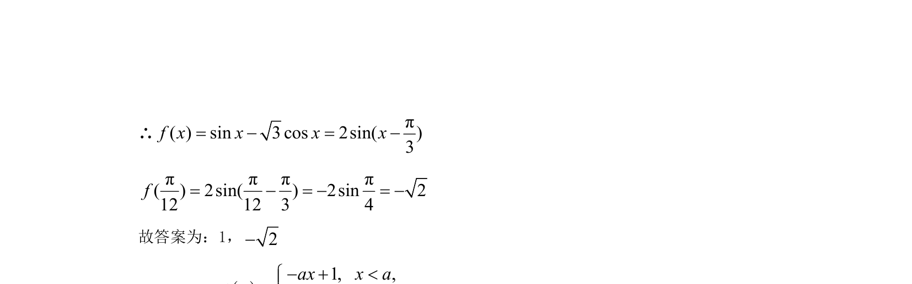

## 题面

## 摘要

已知三角函数零点求参数，并利用辅助角公式化简后代入求值。

## 关联考点

- [[1126-辅助角公式|辅助角公式]]
- [[三角函数零点]]
- [[253-特殊角三角函数值|特殊角三角函数值]]

## 答案与解析

> 📄 原 PDF 第 7 页：`素材/真题/北京/2008-2024·（北京）数学高考真题/2022年高考数学试卷（北京）（解析卷）.pdf`
