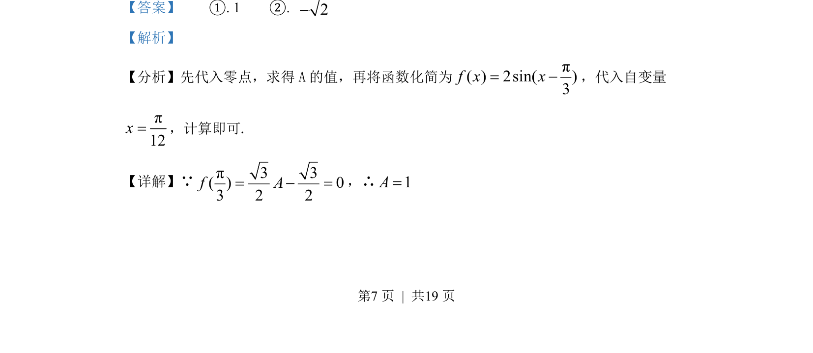
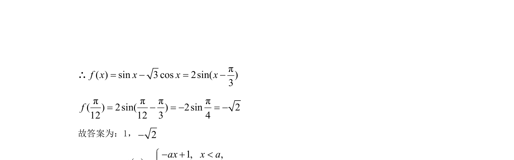

## 题面

## 摘要

已知三角函数零点求参数，并利用辅助角公式化简后代入求值。

## 关联考点

- [[1126-辅助角公式|辅助角公式]]
- [[三角函数零点]]
- [[253-特殊角三角函数值|特殊角三角函数值]]

## 答案与解析

> 📄 原 PDF 第 7 页：`素材/真题/北京/2008-2024·（北京）数学高考真题/2022年高考数学试卷（北京）（解析卷）.pdf`

<!-- 题干文本-start -->
## 题干文本
13. 若函数( ) sin 3 cosf x A x x= -的一个零点为
3p，则A=________；
12fpæ ö=ç ÷è ø
________．
<!-- 题干文本-end -->

<!-- 解析文本-start -->
## 解析文本
【答案】    ①. 1    ②. 2-
【解析】
【分析】先代入零点，求得A的值，再将函数化简为 π( ) 2sin( )3f x x= -，代入自变量
π12x=，计算即可.
【详解】∵π3 3( ) 03 2 2f A= - =，∴1A=
<!-- 解析文本-end -->
