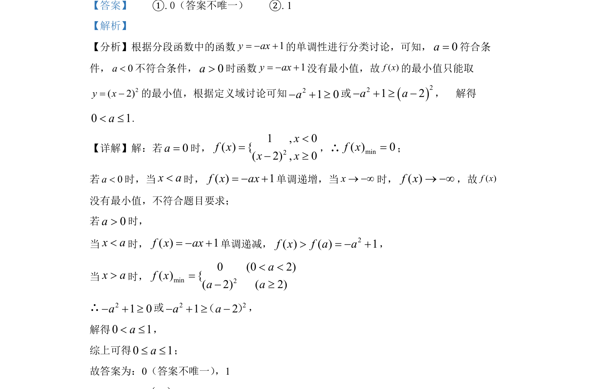

## 题面

## 摘要

分段函数最值与参数范围问题，通过分类讨论分析分段函数单调性及最小值取值条件

## 关联考点

- [[290-分段函数|分段函数]]
- [[419-函数最值-高中|函数最值]]
- [[424-参数分类讨论|分类讨论]]
- [[726-参数范围|参数范围]]

## 答案与解析

> 📄 原 PDF 第 8 页：`素材/真题/北京/2008-2024·（北京）数学高考真题/2022年高考数学试卷（北京）（解析卷）.pdf`
