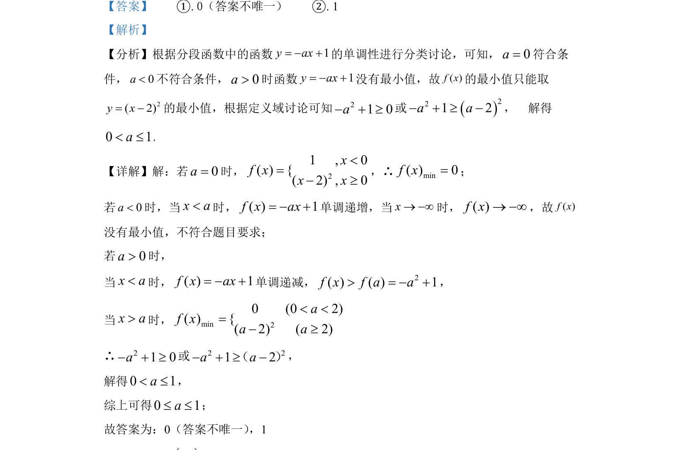

## 题面

## 摘要

分段函数最值与参数范围问题，通过分类讨论分析分段函数单调性及最小值取值条件

## 关联考点

- [[290-分段函数|分段函数]]
- [[419-函数最值-高中|函数最值]]
- [[424-参数分类讨论|分类讨论]]
- [[726-参数范围|参数范围]]

## 答案与解析

> 📄 原 PDF 第 8 页：`素材/真题/北京/2008-2024·（北京）数学高考真题/2022年高考数学试卷（北京）（解析卷）.pdf`

<!-- 题干文本-start -->
## 题干文本
14. 设函数()()21, ,2 , .ax x af xx x a- + <ìï=í- ³ïî
若( )f x存在最小值，则 a 的一个取值为________；a
的最大值为___________．
<!-- 题干文本-end -->

<!-- 解析文本-start -->
## 解析文本
【答案】    ①. 0（答案不唯一）    ②. 1
【解析】
【分析】根据分段函数中的函数 1y ax= - +的单调性进行分类讨论，可知，0a=符合条
件，0a<不符合条件，0a>时函数 1y ax= - +没有最小值，故( )f x的最小值只能取
2( 2)y x= -的最小值，根据定义域讨论可知21 0a- + ³或()221 2a a- + ³ -，  解得 
0 1a< £.
【详解】解：若0a=时， 21 , 0( ) {( 2) , 0xf xx x<=- ³，∴min( ) 0f x=；
若0a<时，当x a<时，( ) 1f x ax= - +单调递增，当x® -¥时，( )f x® -¥，故( )f x
没有最小值，不符合题目要求；
若0a>时，
当x a<时，( ) 1f x ax= - +单调递减， 2( ) ( ) 1f x f a a> = - +，
当x a>时，min20 (0 2)( ) {( 2) ( 2)af xa a< <=- ³
∴21 0a- + ³或2 21 2a a- + ³ -（），
解得0 1a< £，
综上可得0 1a£ £；
故答案为：0（答案不唯一） ，1
<!-- 解析文本-end -->
