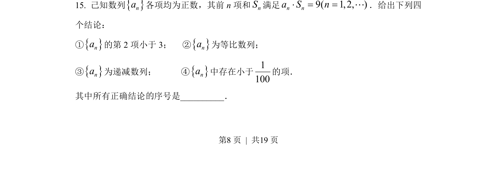
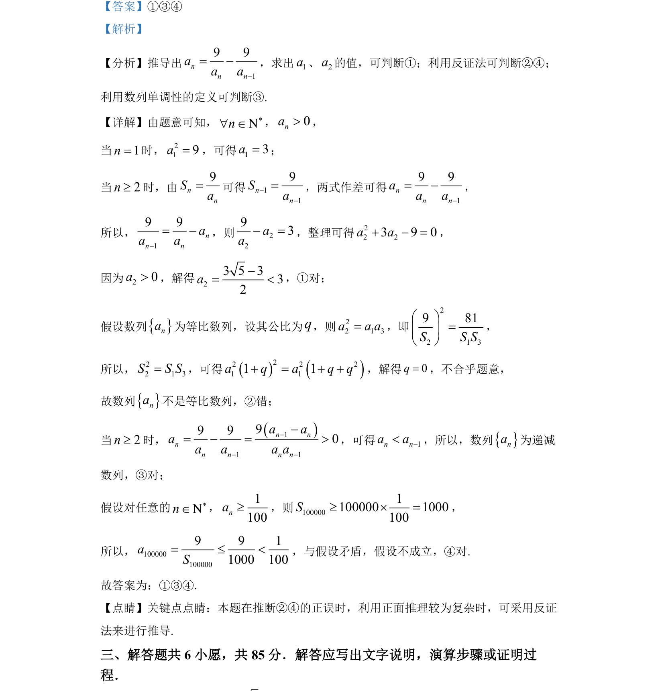

## 题面

## 摘要

数列递推与性质推断，通过条件推导通项并判断数列单调性及是否等比，使用反证法验证不等式。

## 关联考点

- [[383-数列递推公式|数列递推公式]]
- [[等比数列判定]]
- [[455-数列单调性|数列单调性]]
- [[1180-反证法|反证法]]

## 答案与解析

> 📄 原 PDF 第 8 页：`素材/真题/北京/2008-2024·（北京）数学高考真题/2022年高考数学试卷（北京）（解析卷）.pdf`
