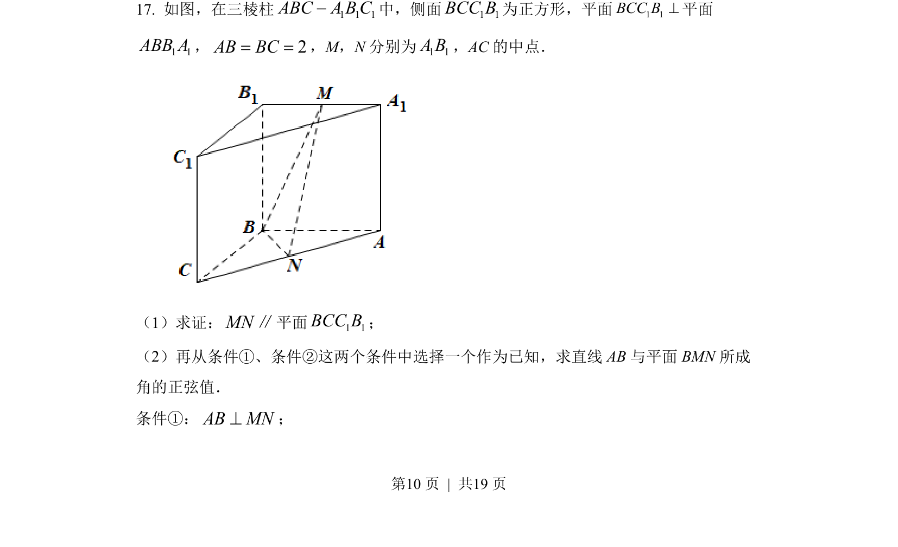
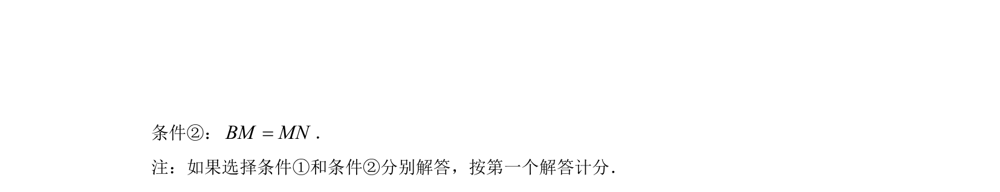
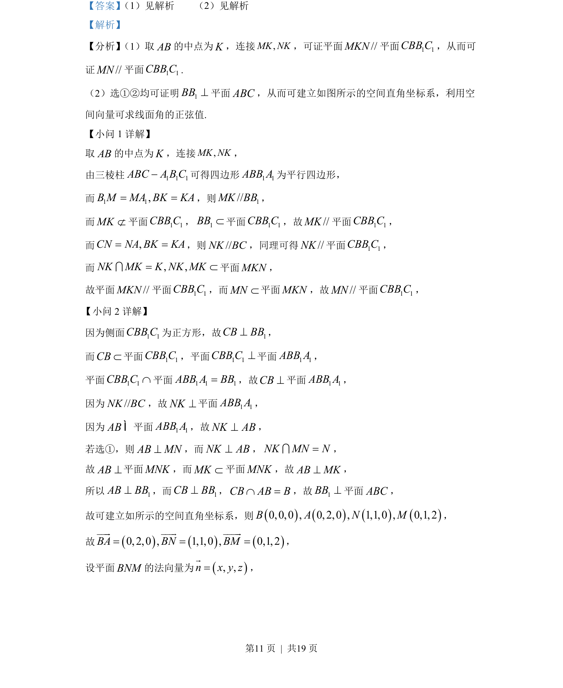
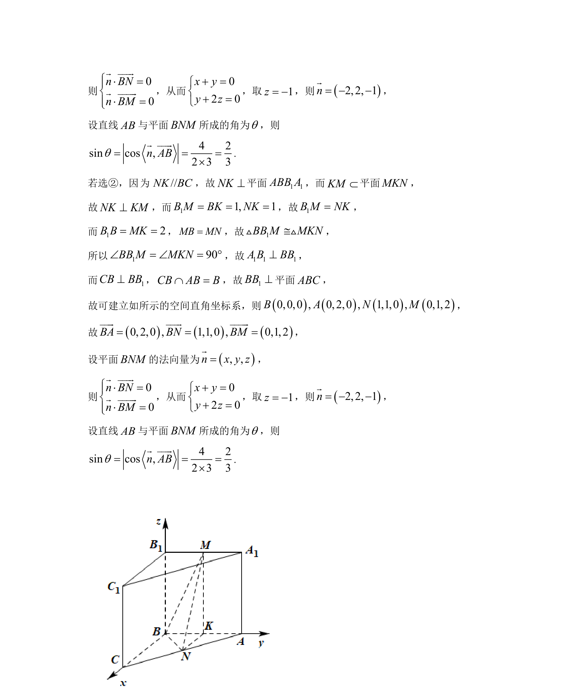

## 题面

## 摘要

线面平行证明与线面角求解，涉及辅助线构造、面面平行性质及空间向量法

## 关联考点

- [[352-空间直线平面平行|线面平行]]
- [[352-空间直线平面平行|面面平行]]
- [[401-空间向量基本概念|空间向量]]
- [[353-空间角|线面角]]

## 答案与解析

> 📄 原 PDF 第 10 页：`素材/真题/北京/2008-2024·（北京）数学高考真题/2022年高考数学试卷（北京）（解析卷）.pdf`
