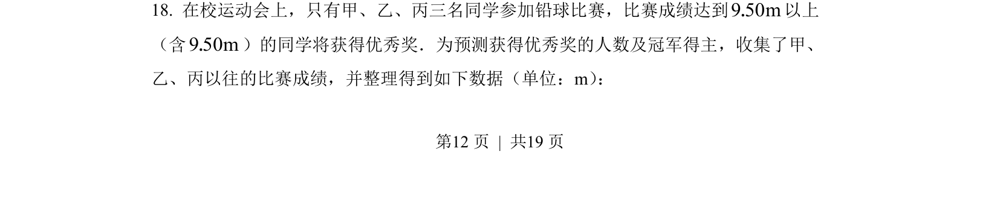
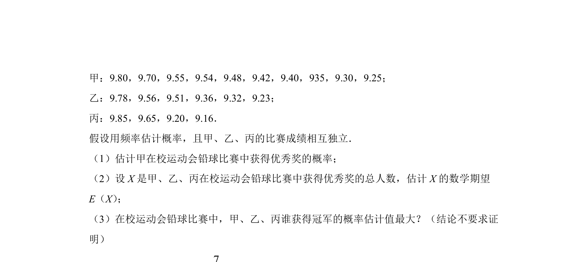
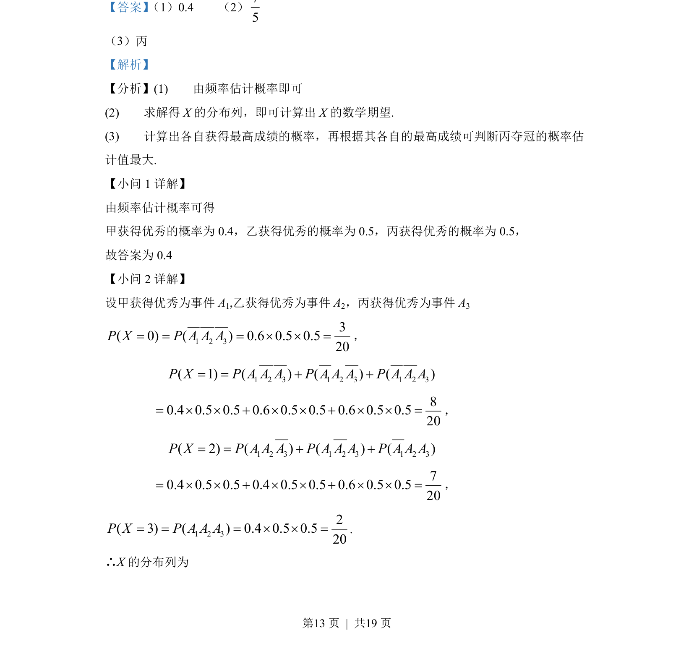
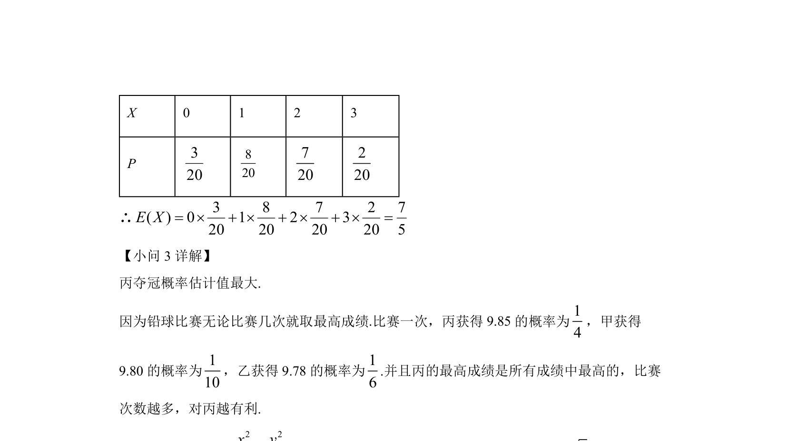

## 题面

## 摘要

本题通过频率估计概率，求随机变量分布列与期望，并比较夺冠概率。

## 关联考点

- [[1188-频率估计概率|频率估计概率]]
- [[1039-离散型随机变量分布列|离散型随机变量分布列]]
- [[1040-离散型随机变量的期望|数学期望]]
- [[概率比较]]

## 答案与解析

> 📄 原 PDF 第 12 页：`素材/真题/北京/2008-2024·（北京）数学高考真题/2022年高考数学试卷（北京）（解析卷）.pdf`
