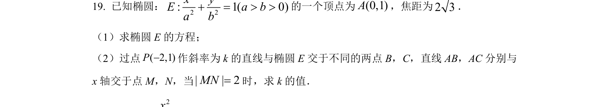
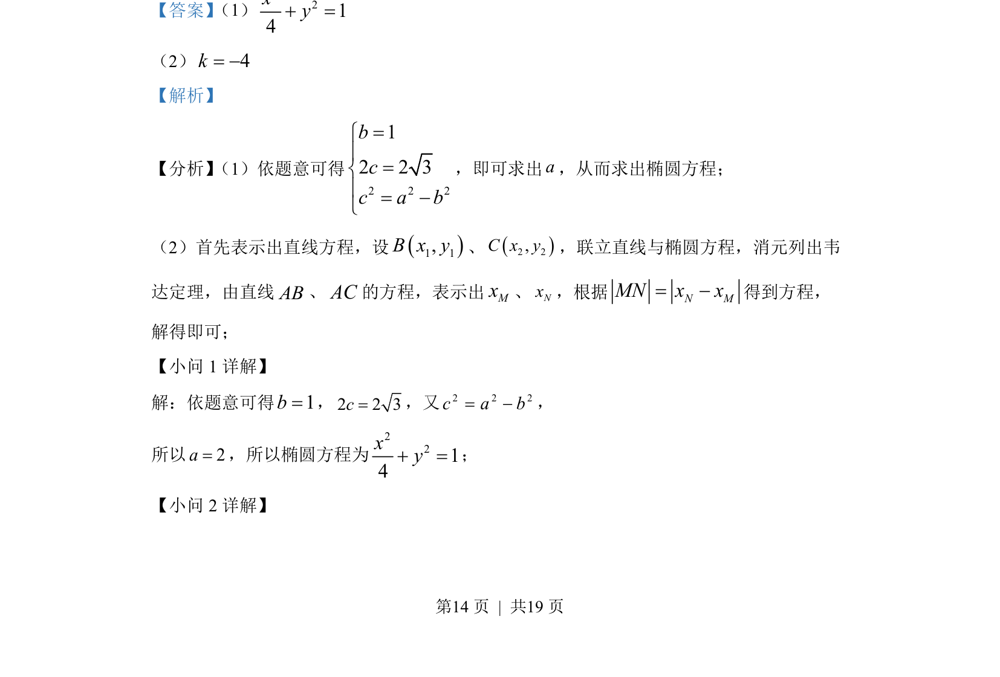
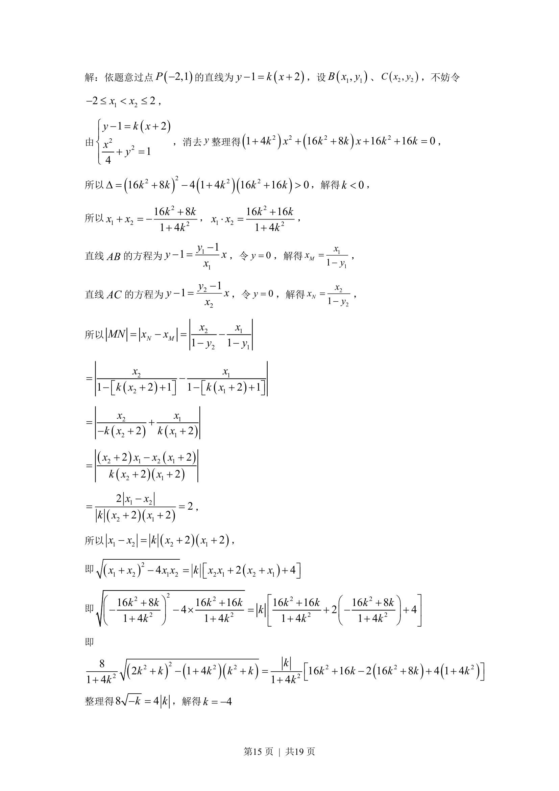

## 题面

## 摘要

本题考查椭圆标准方程的求解以及直线与椭圆相交的定点定值问题，通过联立方程与韦达定理进行代数化简。

## 关联考点

- [[941-椭圆标准方程|椭圆标准方程]]
- [[1391-直线与椭圆位置关系|直线与椭圆位置关系]]
- [[234-韦达定理-初中|韦达定理]]

## 答案与解析

> 📄 原 PDF 第 14 页：`素材/真题/北京/2008-2024·（北京）数学高考真题/2022年高考数学试卷（北京）（解析卷）.pdf`
