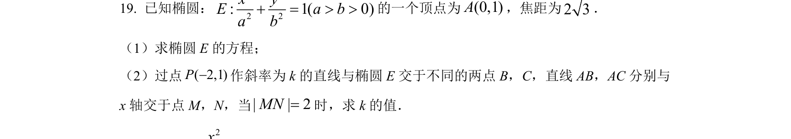
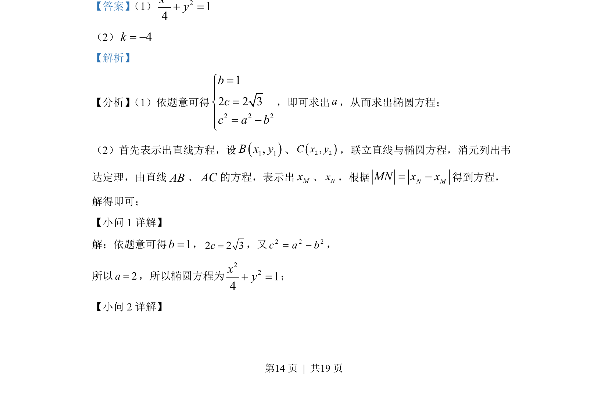
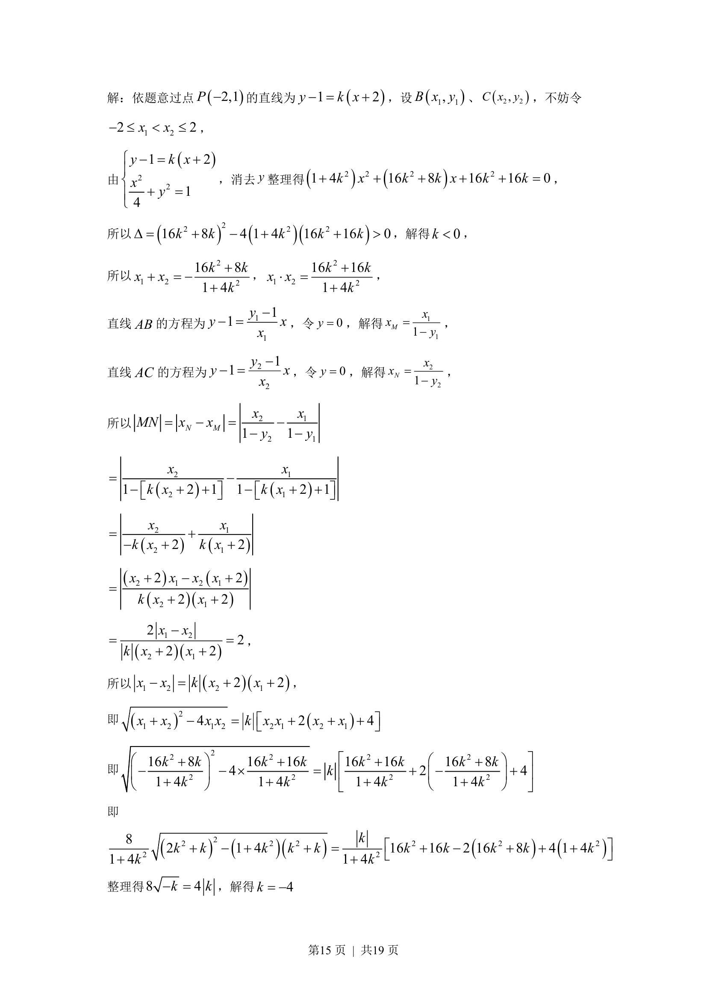

## 题面

## 摘要

本题考查椭圆标准方程的求解以及直线与椭圆相交的定点定值问题，通过联立方程与韦达定理进行代数化简。

## 关联考点

- [[941-椭圆标准方程|椭圆标准方程]]
- [[1391-直线与椭圆位置关系|直线与椭圆位置关系]]
- [[234-韦达定理-初中|韦达定理]]

## 答案与解析

> 📄 原 PDF 第 14 页：`素材/真题/北京/2008-2024·（北京）数学高考真题/2022年高考数学试卷（北京）（解析卷）.pdf`

<!-- 题干文本-start -->
## 题干文本
19. 已知椭圆：
2 22 2: 1( 0)x yE a ba b+ = > >的一个顶点为(0,1)A，焦距为2 3．
（1）求椭圆 E的方程；
（2）过点( 2,1)P-作斜率为 k的直线与椭圆 E交于不同的两点 B，C，直线 AB，AC分别与
x轴交于点 M，N，当| | 2MN=时，求 k的值．
<!-- 题干文本-end -->

<!-- 解析文本-start -->
## 解析文本
【答案】 （1）
2214xy+ =    
（2）4k= -
【解析】
【分析】 （1）依题意可得
2 2 212 2 3bcc a b=ìï=íï= -î
，即可求出a，从而求出椭圆方程；
（2）首先表示出直线方程，设1 1,B x y、2 2,C x y，联立直线与椭圆方程，消元列出韦
达定理，由直线AB、AC的方程，表示出Mx、Nx，根据 N MMN x x= -得到方程，
解得即可；
【小问 1 详解】
解：依题意可得1b=，2 2 3c=，又2 2 2c a b= -，
所以2a=，所以椭圆方程为
2214xy+ =；
【小问 2 详解】
<!-- 解析文本-end -->
