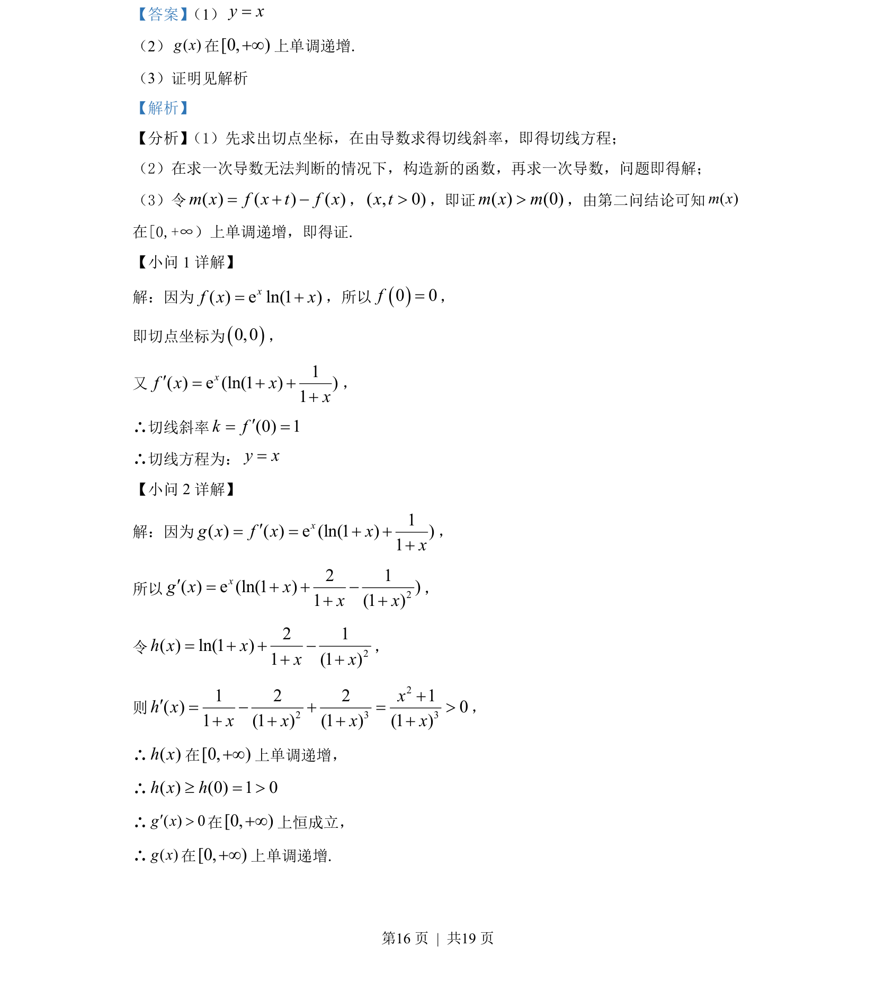
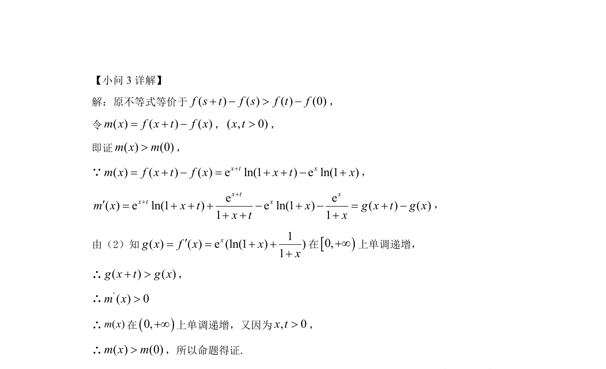

## 题面

## 摘要

考查导数的几何意义求切线方程，利用多次求导判断函数单调性，并构造辅助函数证明不等式。

## 关联考点

- [[440-导数的几何意义|导数的几何意义]]
- [[705-利用导数研究函数的单调性|利用导数研究函数的单调性]]
- [[1412-构造函数证明不等式|构造函数证明不等式]]
- [[二次求导]]

## 答案与解析

> 📄 原 PDF 第 16 页：`素材/真题/北京/2008-2024·（北京）数学高考真题/2022年高考数学试卷（北京）（解析卷）.pdf`
