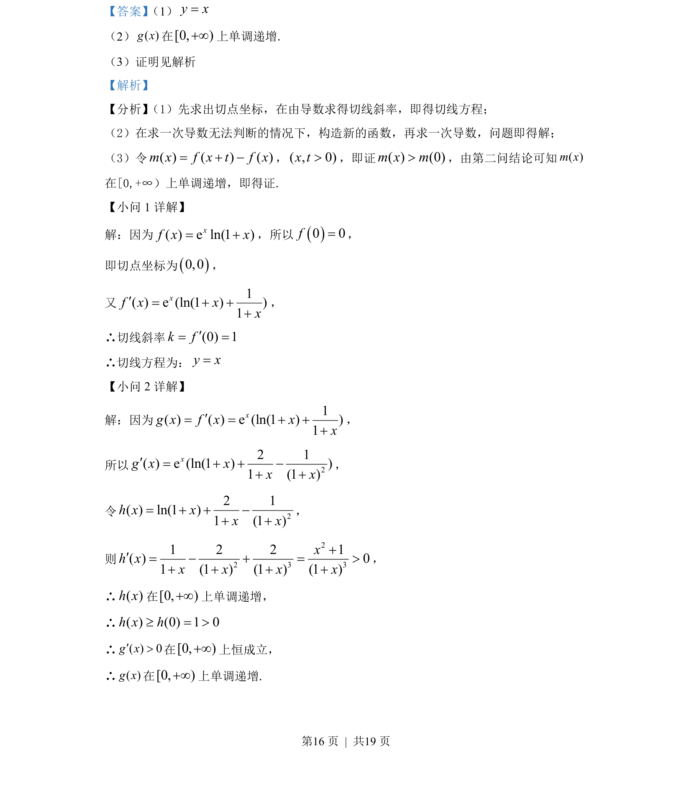
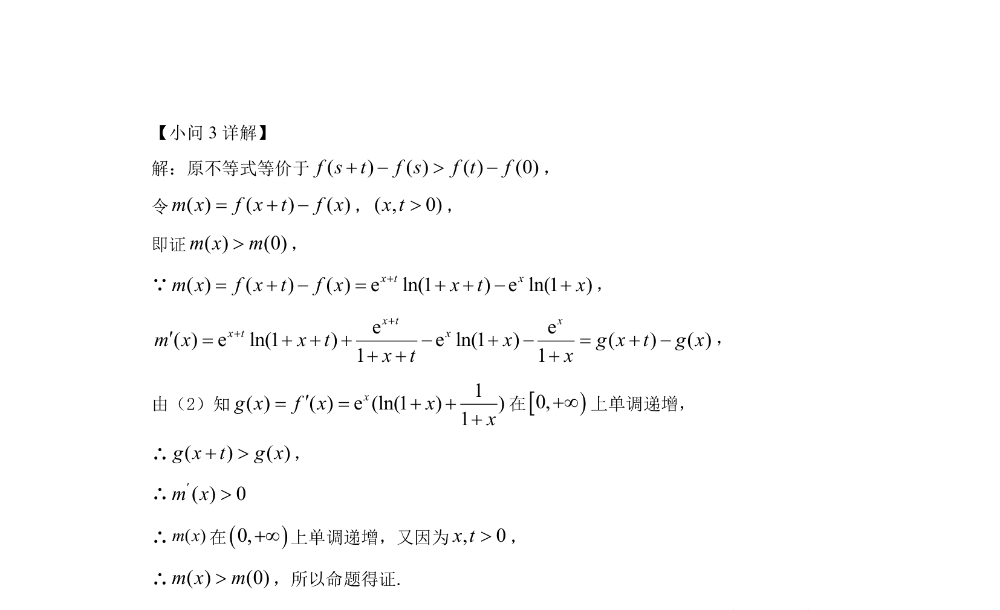

## 题面

## 摘要

考查导数的几何意义求切线方程，利用多次求导判断函数单调性，并构造辅助函数证明不等式。

## 关联考点

- [[440-导数的几何意义|导数的几何意义]]
- [[705-利用导数研究函数的单调性|利用导数研究函数的单调性]]
- [[1412-构造函数证明不等式|构造函数证明不等式]]
- [[二次求导]]

## 答案与解析

> 📄 原 PDF 第 16 页：`素材/真题/北京/2008-2024·（北京）数学高考真题/2022年高考数学试卷（北京）（解析卷）.pdf`

<!-- 题干文本-start -->
## 题干文本
20. 已知函数( ) e ln(1 )xf x x= +．
（1）求曲线( )y f x=在点(0, (0))f处的切线方程；
（2）设( ) ( )g x f x¢=，讨论函数( )g x在[0, )+¥上的单调性；
（3）证明：对任意的, (0, )s tÎ +¥，有( ) ( ) ( )f s t f s f t+ > +．
<!-- 题干文本-end -->

<!-- 解析文本-start -->
## 解析文本
【答案】 （1）y x=    
（2）( )g x在[0, )+¥上单调递增.    
（3）证明见解析
【解析】
【分析】 （1）先求出切点坐标，在由导数求得切线斜率，即得切线方程；
（2）在求一次导数无法判断的情况下，构造新的函数，再求一次导数，问题即得解；
（3）令( ) ( ) ( )m x f x t f x= + -，( , 0)x t>，即证( ) (0)m x m>，由第二问结论可知()mx
在[0,+∞）上单调递增，即得证.
【小问 1 详解】
解：因为( ) e ln(1 )xf x x= +，所以0 0=f，
即切点坐标为0,0，
又 1( ) e (ln(1 ) )1xf x xx= + ++¢ ，
∴切线斜率(0) 1k f¢= =
∴切线方程为：y x=
【小问 2 详解】
解：因为 1( ) ( ) e (ln(1 ) )1xg x f x xx= + +¢=+
，    
所以 22 1( ) e (ln(1 ) )1 (1 )xg x xx x= + + -+ +¢ ，
令 22 1( ) ln(1 )1 (1 )h x xx x= + + -+ +，
则
22 3 31 2 2 1( ) 01 (1 ) (1 ) (1 )xh xx x x x+= - + = >+ + + +¢ ， 
∴( )h x在[0, )+¥上单调递增，
∴( ) (0) 1 0h x h³ = >
∴( ) 0g x¢>在[0, )+¥上恒成立，
∴( )g x在[0, )+¥上单调递增.
<!-- 解析文本-end -->
