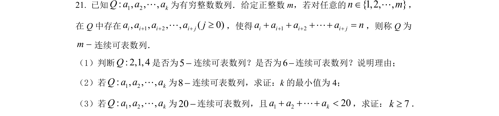
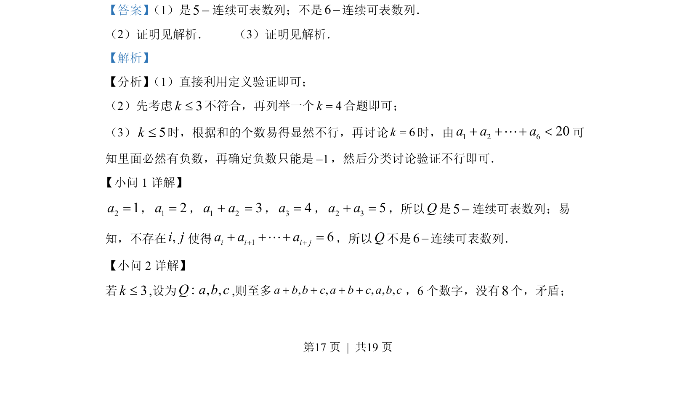
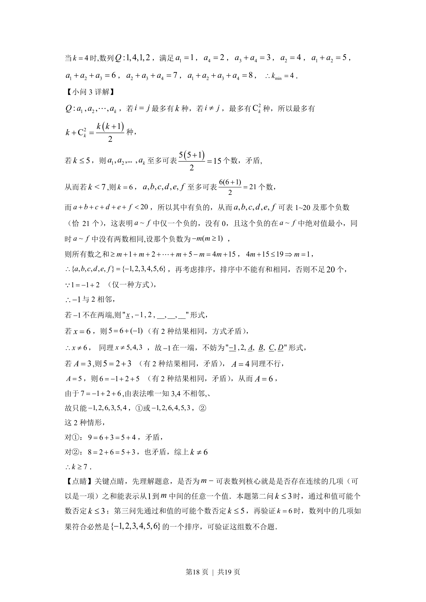

## 题面

## 摘要

考查数列新定义，通过枚举与分类讨论确定参数k的取值，涉及和个数与负数分析。

## 关联考点

- [[1381-数列新定义|数列新定义]]
- [[424-参数分类讨论|分类讨论]]
- [[1090-组合计数|组合计数]]
- [[存在性证明]]

## 答案与解析

> 📄 原 PDF 第 17 页：`素材/真题/北京/2008-2024·（北京）数学高考真题/2022年高考数学试卷（北京）（解析卷）.pdf`
