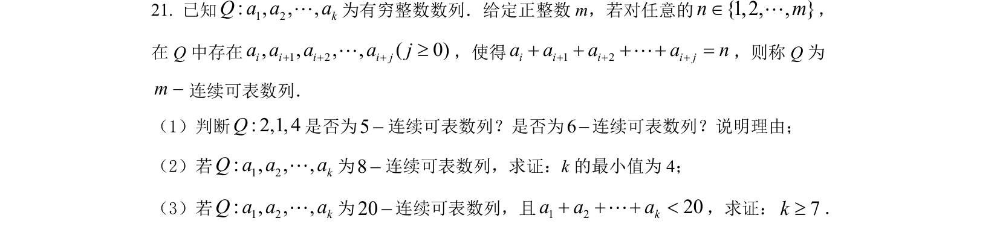
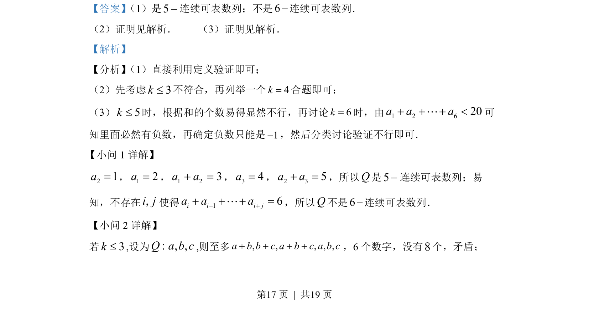
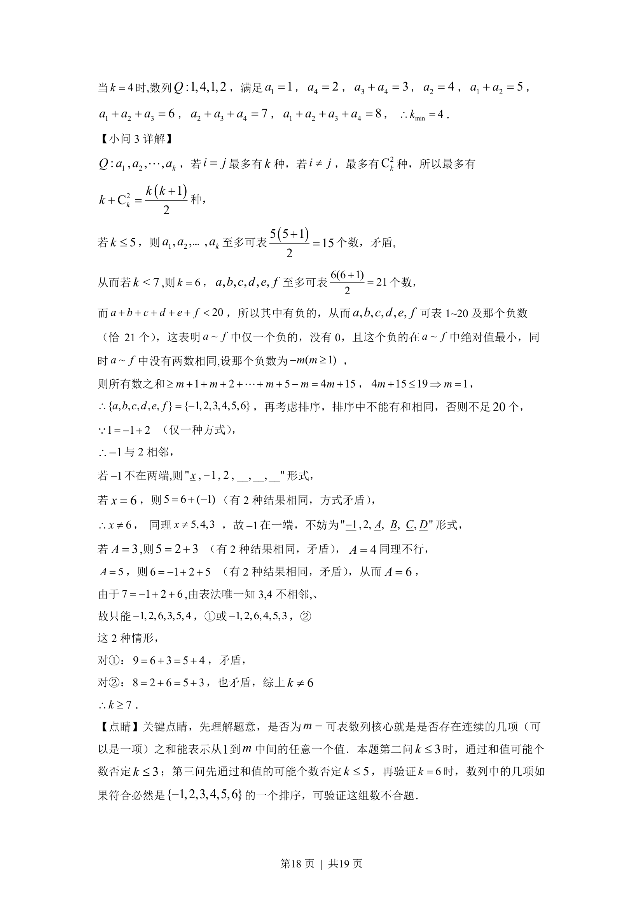

## 题面

## 摘要

考查数列新定义，通过枚举与分类讨论确定参数k的取值，涉及和个数与负数分析。

## 关联考点

- [[1381-数列新定义|数列新定义]]
- [[424-参数分类讨论|分类讨论]]
- [[1090-组合计数|组合计数]]
- [[存在性证明]]

## 答案与解析

> 📄 原 PDF 第 17 页：`素材/真题/北京/2008-2024·（北京）数学高考真题/2022年高考数学试卷（北京）（解析卷）.pdf`

<!-- 题干文本-start -->
## 题干文本
21. 已知1 2: , , ,kQ a a aL为有穷整数数列．给定正整数 m，若对任意的{ 1,2, , }n mÎL，
在 Q 中存在1 2, , , , ( 0)i i i i ja a a a j+ + +³L，使得 1 2i i i i ja a a a n+ + ++ + + + =L，则称 Q 为
m-连续可表数列．
（1）判断: 2,1, 4Q是否为5-连续可表数列？是否为6-连续可表数列？说明理由；
（2）若1 2: , , ,kQ a a aL为8-连续可表数列，求证：k的最小值为 4；
（3）若1 2: , , ,kQ a a aL为20-连续可表数列，且1 220ka a a+ + + <L，求证：7k³．
<!-- 题干文本-end -->

<!-- 解析文本-start -->
## 解析文本
【答案】 （1）是5-连续可表数列；不是6-连续可表数列．    
（2）证明见解析．    （3）证明见解析．
【解析】
【分析】 （1）直接利用定义验证即可；
（2）先考虑3k£不符合，再列举一个4k=合题即可；
（3）5k£时，根据和的个数易得显然不行，再讨论6k=时，由1 2 620a a a+ + + <L可
知里面必然有负数，再确定负数只能是1-，然后分类讨论验证不行即可．
小问 1 详解】
21a=，12a=，1 23a a+ =，34a=，2 35a a+ =，所以Q是5-连续可表数列；易
知，不存在,i j使得 16i i i ja a a+ ++ + + =L，所以Q不是6-连续可表数列．
【小问 2 详解】
若3k£,设为:Q, ,a b c,则至多, , , , ,a b b c a b c a b c+ + + +，6 个数字，没有8个，矛盾；
【
<!-- 解析文本-end -->
