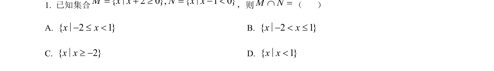
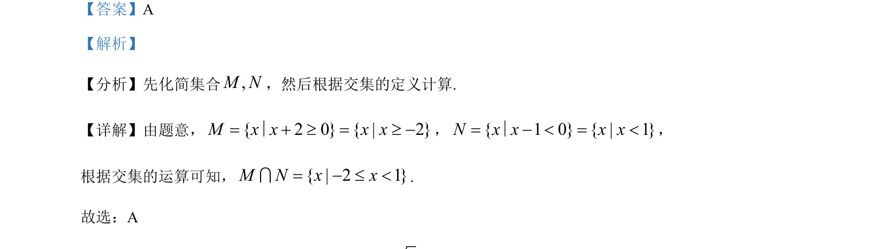

## 题面

## 摘要

本题主要考查集合的交集运算，需先解一次不等式化简集合再求交集。

## 关联考点

- [[1139-集合的交集|集合的交集]]
- [[不等式的解法]]

## 答案与解析

> 📄 原 PDF 第 1 页：`素材/真题/北京/2008-2024·（北京）数学高考真题/2023年高考数学试卷（北京）（解析卷）.pdf`

<!-- 题干文本-start -->
## 题干文本
1. 已知集合{ 2 0}, { 1 0}M x x N x x= + ³ = - <∣ ∣，则M NÇ =（    ）
A. { 2 1 }x x- £ <∣B. { 2 1 }x x- < £∣
C. { 2}x x³ -∣D. { 1 }x x<∣
<!-- 题干文本-end -->

<!-- 解析文本-start -->
## 解析文本
【答案】A
【解析】
【分析】先化简集合,M N，然后根据交集的定义计算.
【详解】由题意，{ 2 0} { | 2}M x x x x= + ³ = ³ -∣，{ 1 0} { | 1 }N x x x x= - < = <∣，
根据交集的运算可知，{ | 2 1 }M N x x= - £ <I.
故选：A
<!-- 解析文本-end -->
