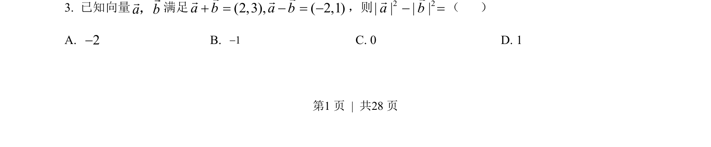
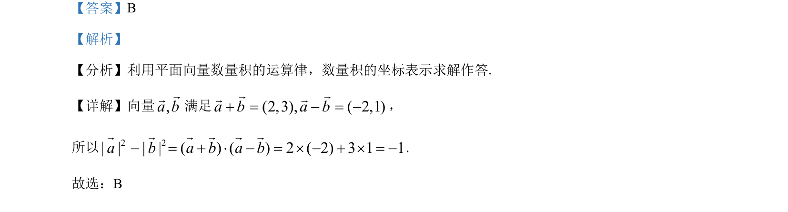

## 题面

## 摘要

本题主要考查平面向量数量积的坐标运算及运算律，通过已知向量和与差的坐标求模平方差。

## 关联考点

- [[855-平面向量数量积|平面向量数量积]]
- [[789-坐标运算|坐标运算]]
- [[052-运算律|运算律]]

## 答案与解析

> 📄 原 PDF 第 1 页：`素材/真题/北京/2008-2024·（北京）数学高考真题/2023年高考数学试卷（北京）（解析卷）.pdf`
