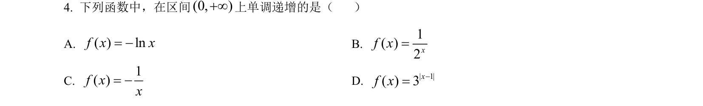
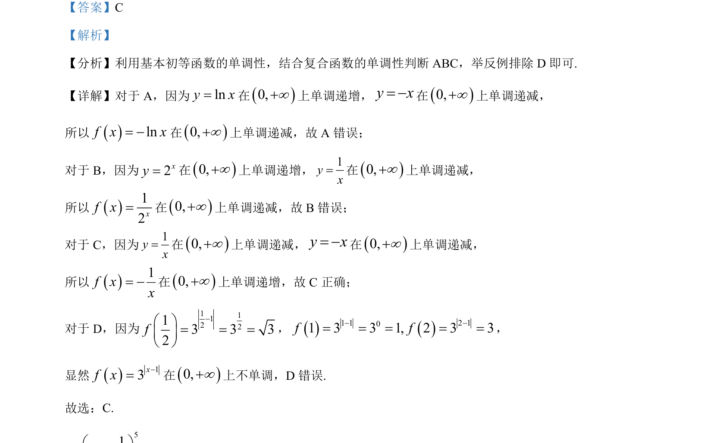

## 题面

## 摘要

考查基本初等函数与复合函数的单调性判断，结合排除法选择正确选项。

## 关联考点

- [[432-导数与函数单调性|函数单调性]]
- [[296-复合函数|复合函数]]
- [[基本初等函数]]

## 答案与解析

> 📄 原 PDF 第 2 页：`素材/真题/北京/2008-2024·（北京）数学高考真题/2023年高考数学试卷（北京）（解析卷）.pdf`
