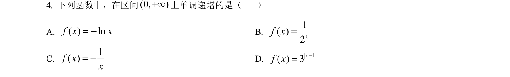
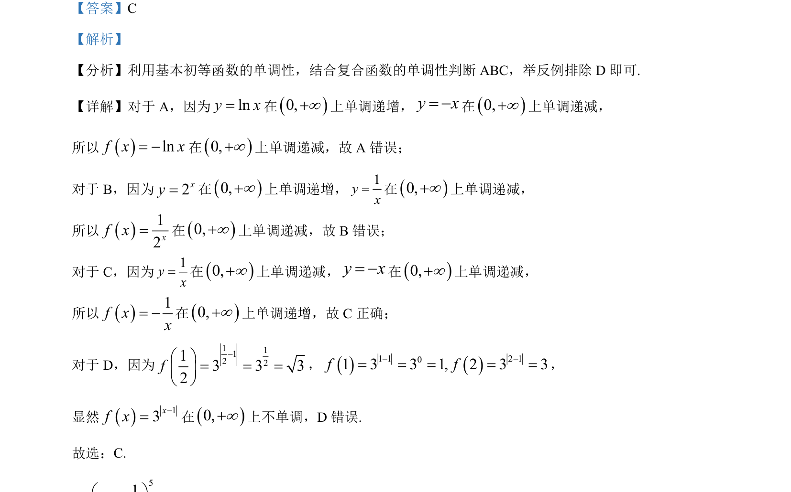

## 题面

## 摘要

考查基本初等函数与复合函数的单调性判断，结合排除法选择正确选项。

## 关联考点

- [[432-导数与函数单调性|函数单调性]]
- [[296-复合函数|复合函数]]
- [[1373-基本初等函数|基本初等函数]]

## 答案与解析

> 📄 原 PDF 第 2 页：`素材/真题/北京/2008-2024·（北京）数学高考真题/2023年高考数学试卷（北京）（解析卷）.pdf`

<!-- 题干文本-start -->
## 题干文本
4. 下列函数中，在区间(0, )+¥上单调递增的是（    ）
A. ( ) lnf x x= -B. 1( )2xf x=
C. 1( )f xx= -D. | 1|( ) 3xf x-=
<!-- 题干文本-end -->

<!-- 解析文本-start -->
## 解析文本
【答案】C
【解析】
【分析】利用基本初等函数的单调性，结合复合函数的单调性判断 ABC，举反例排除 D 即可.
【详解】对于 A，因为lny x=在()0,¥+上单调递增，y x= -在()0,¥+上单调递减，
所以()lnf x x= -在()0,¥+上单调递减，故 A 错误；
对于 B，因为2xy=在()0,¥+上单调递增，1yx=在()0,¥+上单调递减，
所以()12xf x=在()0,¥+上单调递减，故 B错误；
对于 C，因为1yx=在()0,¥+上单调递减，y x= -在()0,¥+上单调递减，
所以()1f xx= -在()0,¥+上单调递增，故 C正确；
对于 D，因为
1112213 3 32f-æ ö= = =ç ÷è ø
，()()1 1 2 101 3 3 1, 2 3 3f f- -= = = = =，
显然()13xf x-=在()0,¥+上不单调，D 错误.
故选：C.
<!-- 解析文本-end -->
