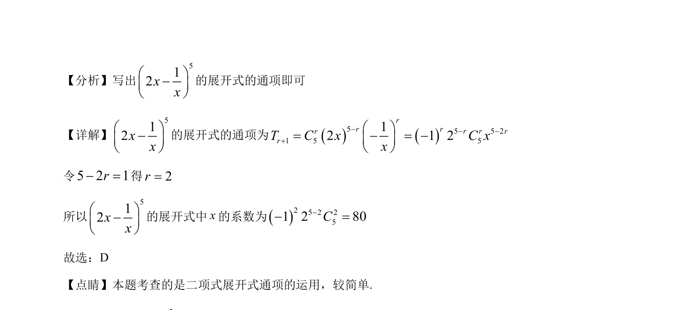

## 题面

## 摘要

求 (2x - 1/x)^5 展开式中 x 的系数。

## 关联考点

- [[472-二项式定理|二项式定理]]
- [[1160-展开式通项|展开式通项]]
- [[197-待定系数法|系数]]

## 答案与解析

> 📄 原 PDF 第 2 页：`素材/真题/北京/2008-2024·（北京）数学高考真题/2023年高考数学试卷（北京）（解析卷）.pdf`
