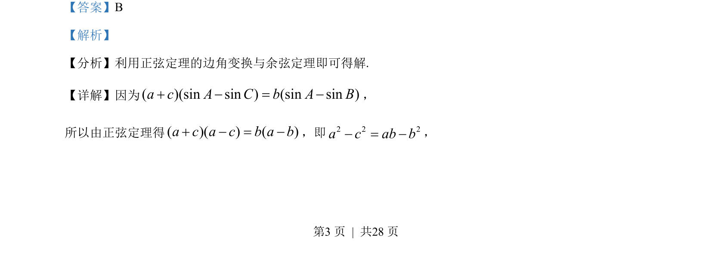
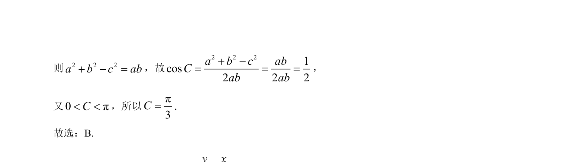

## 题面

## 摘要

本题考查利用正弦定理进行边角互化，并结合余弦定理求解三角形内角。

## 关联考点

- [[126-定理|正弦定理]]
- [[126-定理|余弦定理]]
- [[边角互化]]

## 答案与解析

> 📄 原 PDF 第 3 页：`素材/真题/北京/2008-2024·（北京）数学高考真题/2023年高考数学试卷（北京）（解析卷）.pdf`

<!-- 题干文本-start -->
## 题干文本
7. 在ABCV中，( )(sin sin ) (sin sin )a c A C b A B+ - = -，则CÐ =（    ）
A. π6
B. π3
C. 2π3
D. 5π6
<!-- 题干文本-end -->

<!-- 解析文本-start -->
## 解析文本
【答案】B
【解析】
【分析】利用正弦定理的边角变换与余弦定理即可得解.
【详解】因为( )(sin sin ) (sin sin )a c A C b A B+ - = -，
所以由正弦定理得( )( ) ( )a c a c b a b+ - = -，即2 2 2a c ab b- = -，
<!-- 解析文本-end -->
