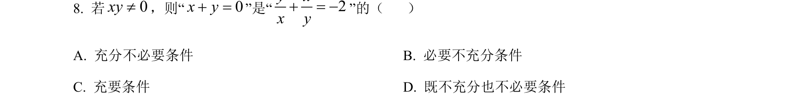
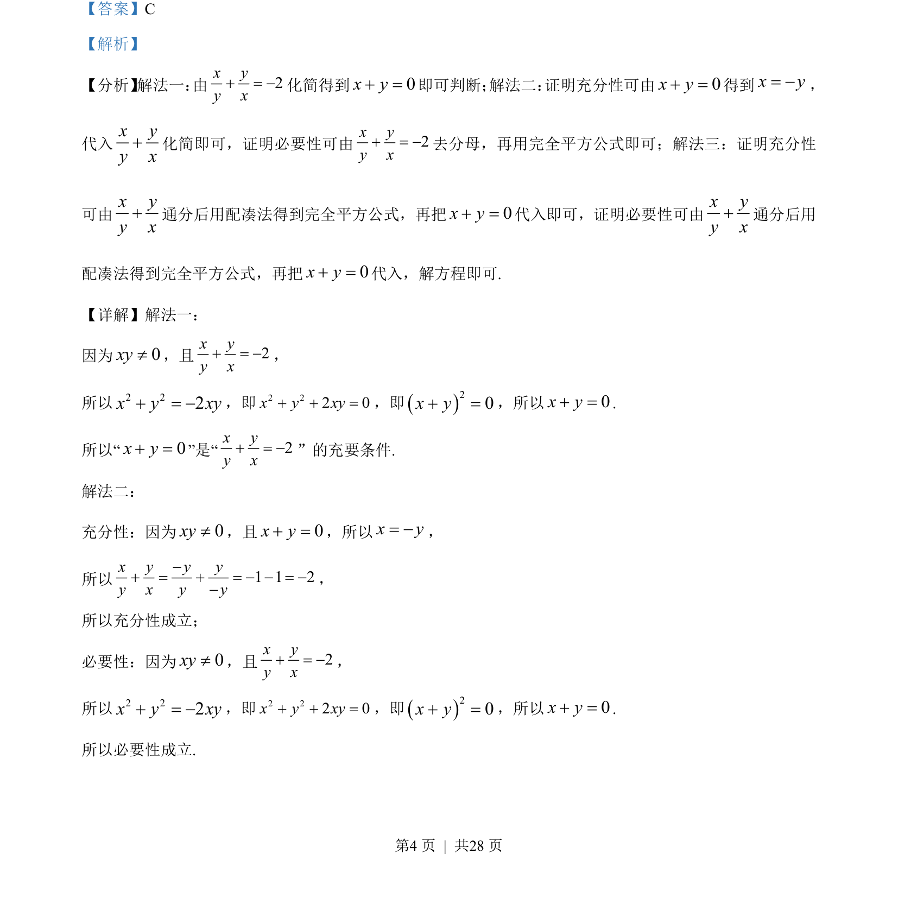
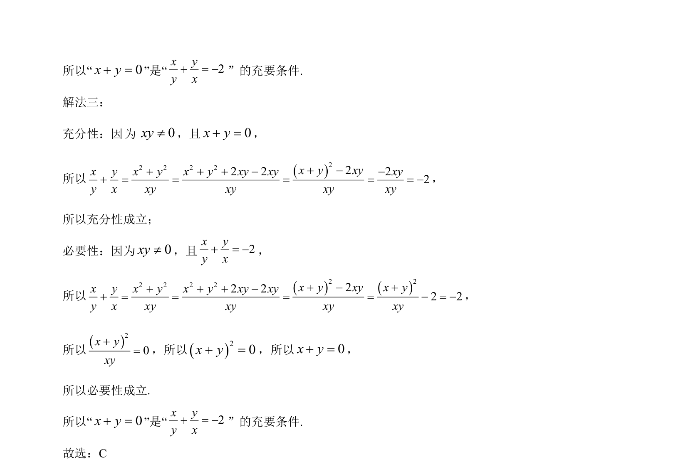

## 题面

## 摘要

考查分式方程化简及充要条件的代数证明，涉及完全平方公式配凑。

## 关联考点

- [[分式化简]]
- [[163-完全平方公式|完全平方公式]]
- [[充要条件证明]]

## 答案与解析

> 📄 原 PDF 第 4 页：`素材/真题/北京/2008-2024·（北京）数学高考真题/2023年高考数学试卷（北京）（解析卷）.pdf`

<!-- 题干文本-start -->
## 题干文本
8. 若0xy¹，则“0x y+ =”是“ 2y xx y+ = -”的（    ）
A. 充分不必要条件 B. 必要不充分条件
C. 充要条件 D. 既不充分也不必要条件
<!-- 题干文本-end -->

<!-- 解析文本-start -->
## 解析文本
【答案】C
【解析】
【分析】 解法一： 由2x yy x+ = -化简得到0x y+ =即可判断； 解法二： 证明充分性可由0x y+ =得到x y= -，
代入
x yy x+化简即可，证明必要性可由 2x yy x+ = -去分母，再用完全平方公式即可；解法三：证明充分性
可由
x yy x+通分后用配凑法得到完全平方公式，再把0x y+ =代入即可，证明必要性可由
x yy x+通分后用
配凑法得到完全平方公式，再把0x y+ =代入，解方程即可.
【详解】解法一：
因为0xy¹，且 2x yy x+ = -，
所以2 22x y xy+ = -，即2 22 0x y xy+ + =，即()20x y+ =，所以0x y+ =.
所以“0x y+ =”是“ 2x yy x+ = -”的充要条件.
解法二：
充分性：因为0xy¹，且0x y+ =，所以x y= -，
所以 1 1 2x y y yy x y y-+ = + = - - = --，
所以充分性成立；
必要性：因为0xy¹，且 2x yy x+ = -，
所以2 22x y xy+ = -，即2 22 0x y xy+ + =，即()20x y+ =，所以0x y+ =.
所以必要性成立.
<!-- 解析文本-end -->
