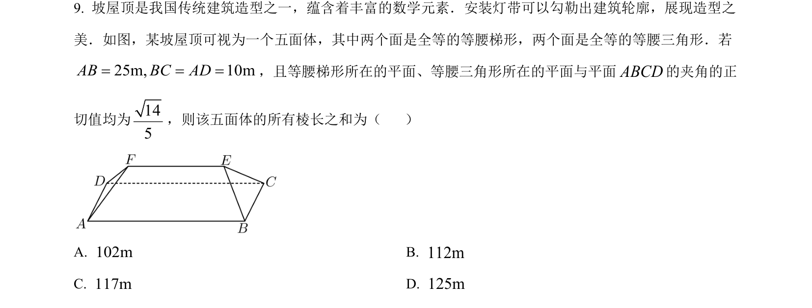
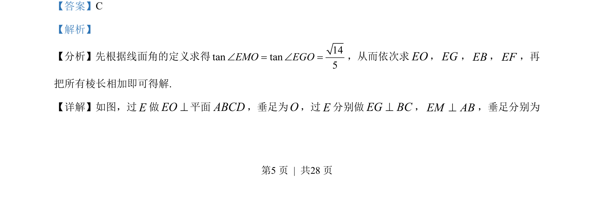
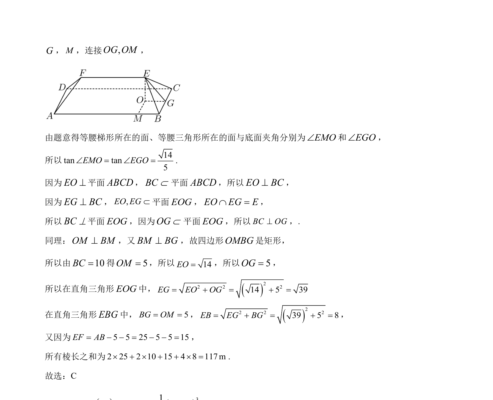

## 题面

## 摘要

通过线面角定义及几何关系求几何体各棱长，并计算所有棱长之和

## 关联考点

- [[353-空间角|线面角]]
- [[1389-棱长计算|棱长计算]]
- [[1055-立体几何|立体几何]]

## 答案与解析

> 📄 原 PDF 第 5 页：`素材/真题/北京/2008-2024·（北京）数学高考真题/2023年高考数学试卷（北京）（解析卷）.pdf`

<!-- 题干文本-start -->
## 题干文本
9. 坡屋顶是我国传统建筑造型之一，蕴含着丰富的数学元素．安装灯带可以勾勒出建筑轮廓，展现造型之
美．如图，某坡屋顶可视为一个五面体，其中两个面是全等的等腰梯形，两个面是全等的等腰三角形．若
25m, 10mAB BC AD= = =，且等腰梯形所在的平面、等腰三角形所在的平面与平面ABCD的夹角的正
切值均为145
，则该五面体的所有棱长之和为（    ）
  
A. 102mB. 112m
C. 117mD. 125m
<!-- 题干文本-end -->

<!-- 解析文本-start -->
## 解析文本
【答案】C
【解析】
【分析】先根据线面角的定义求得
5tan tan14EMO EGOÐ = Ð =，从而依次求EO，EG，EB，EF，再
把所有棱长相加即可得解.
【详解】如图，过E做EO^平面ABCD，垂足为O，过E分别做EG BC^，EM AB^，垂足分别为
为
<!-- 解析文本-end -->
