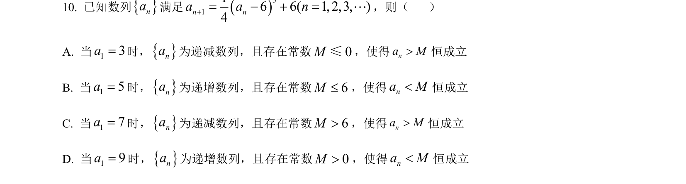
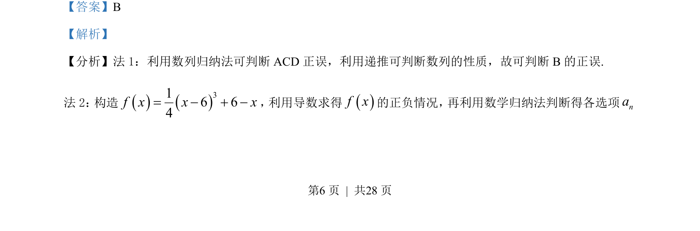
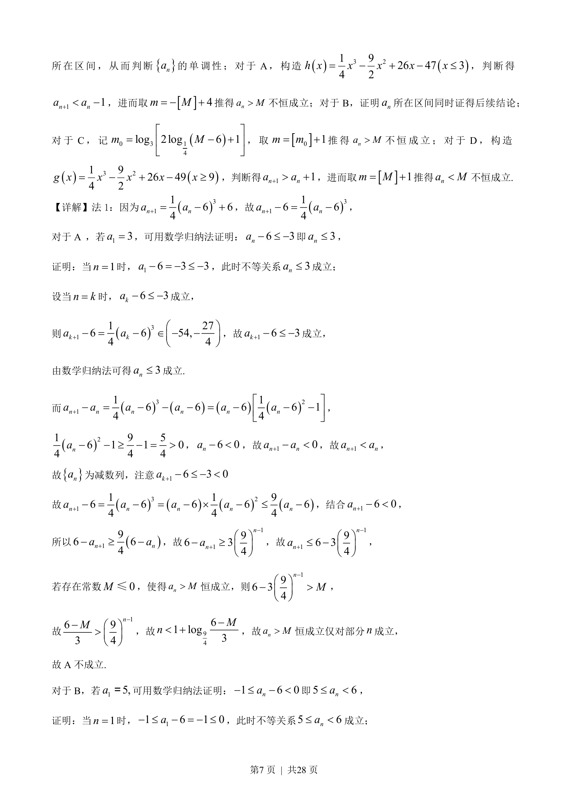
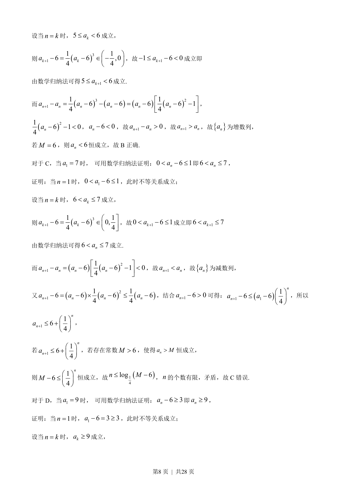
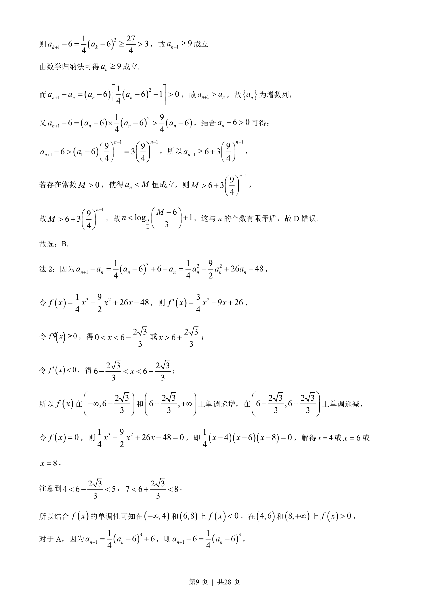
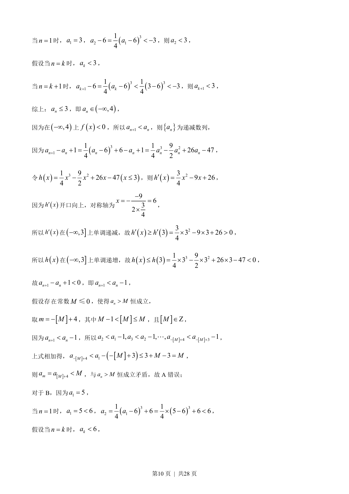
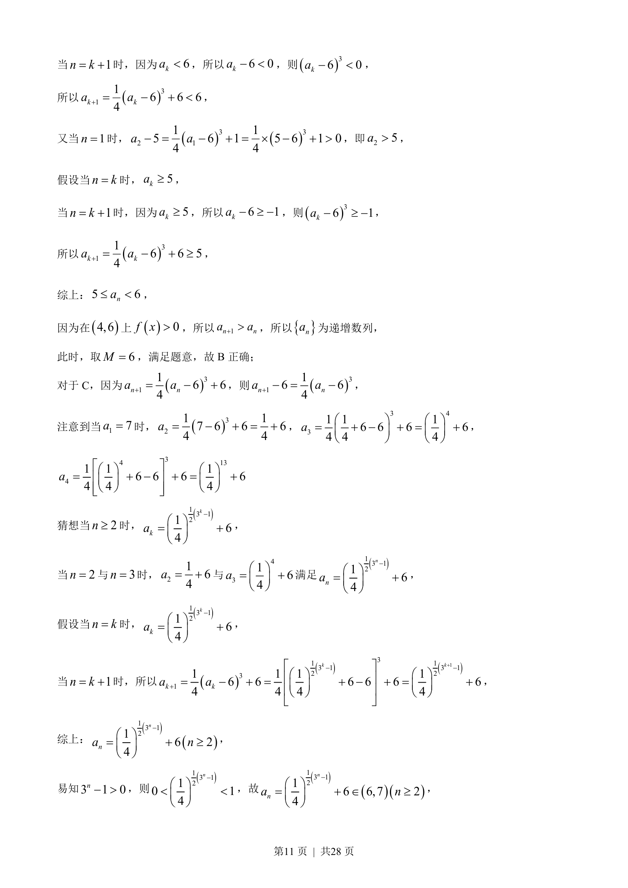
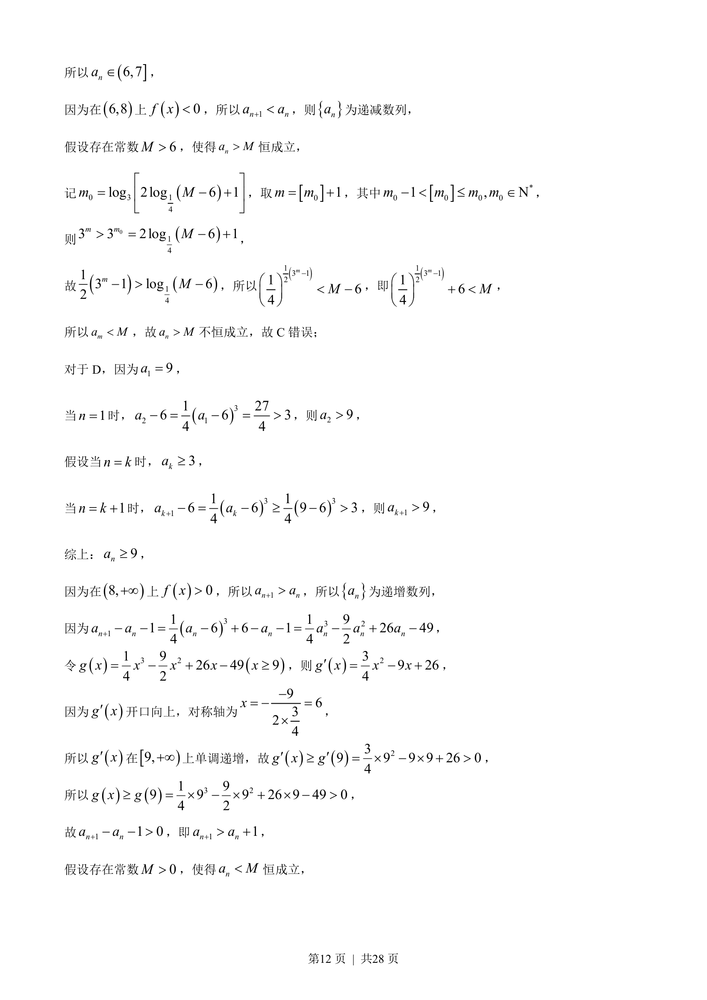
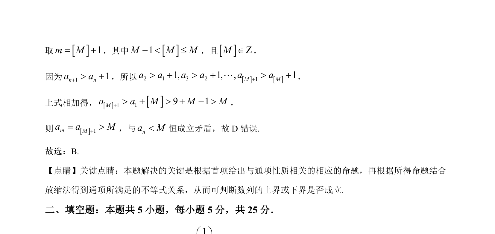

## 题面

## 摘要

考查由递推公式确定的数列性质，运用数学归纳法判断单调性与有界性，分析恒成立问题。

## 关联考点

- [[1382-数列递推|数列递推]]
- [[386-数学归纳法-初步|数学归纳法]]
- [[455-数列单调性|数列单调性]]
- [[531-不等式恒成立|不等式恒成立]]

## 答案与解析

> 📄 原 PDF 第 6 页：`素材/真题/北京/2008-2024·（北京）数学高考真题/2023年高考数学试卷（北京）（解析卷）.pdf`
