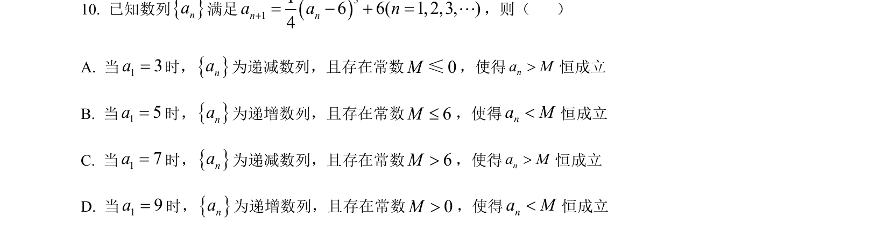
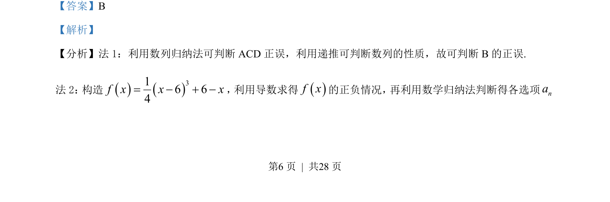
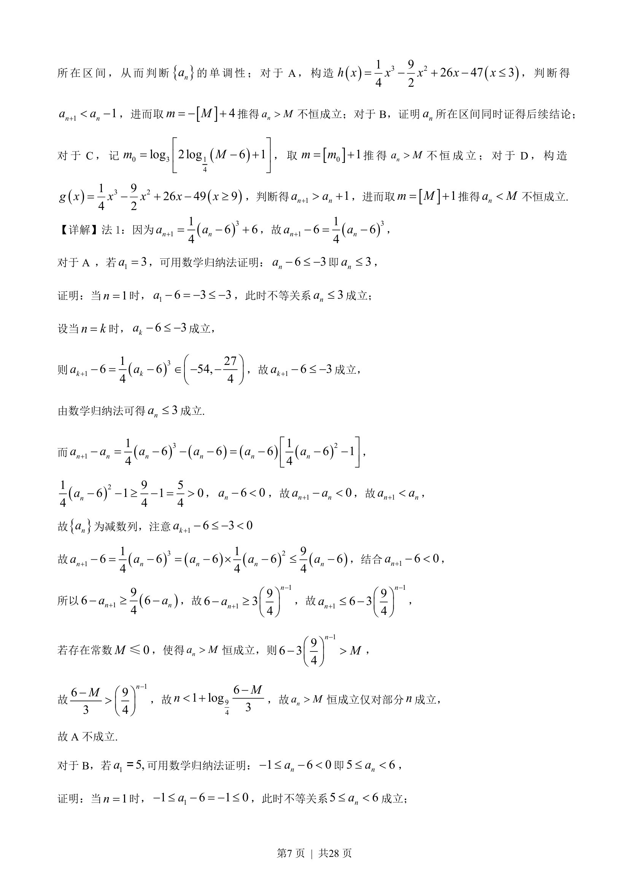
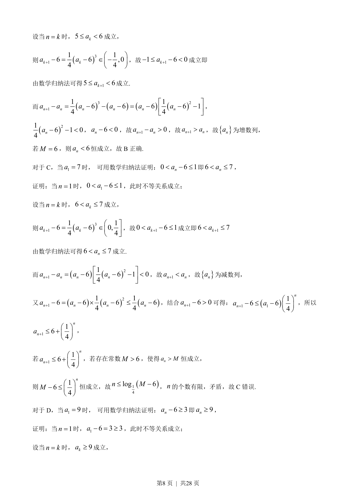
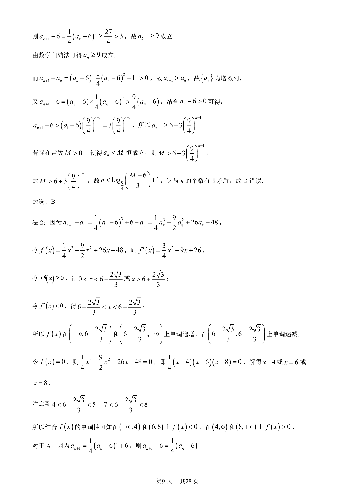
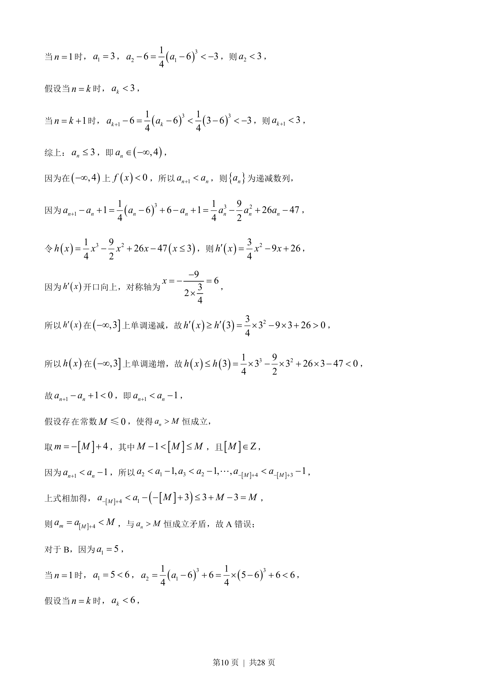
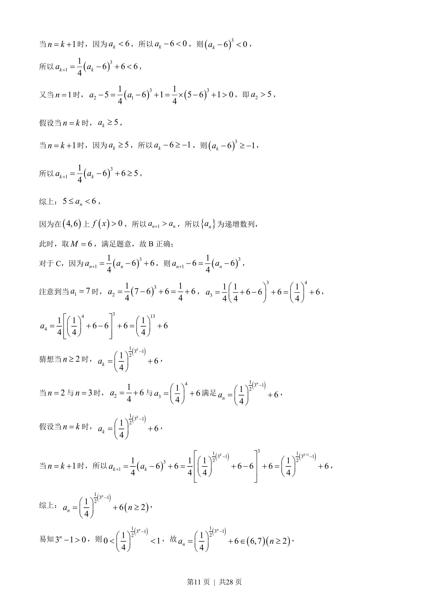
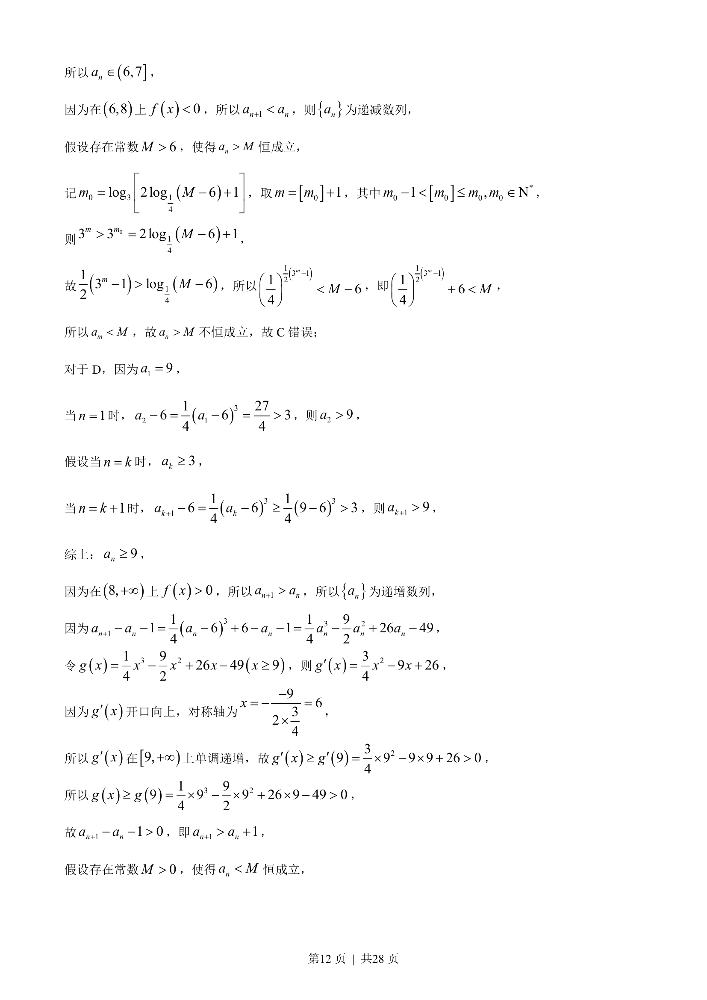
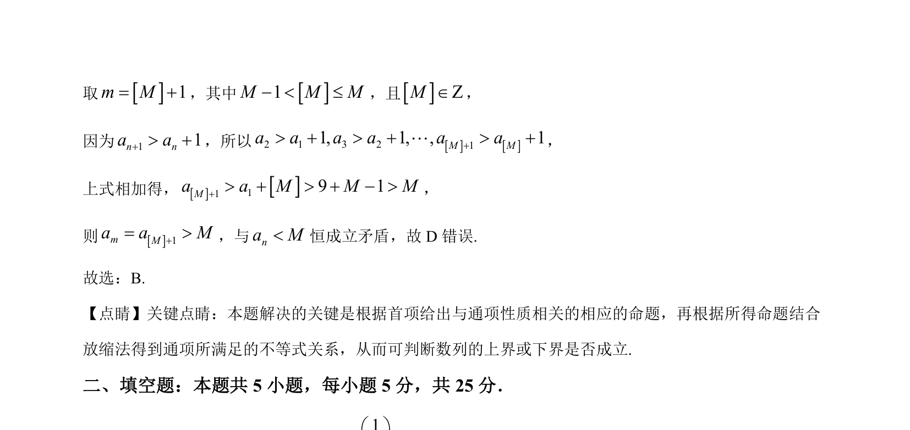

## 题面

## 摘要

考查由递推公式确定的数列性质，运用数学归纳法判断单调性与有界性，分析恒成立问题。

## 关联考点

- [[1382-数列递推|数列递推]]
- [[386-数学归纳法-初步|数学归纳法]]
- [[455-数列单调性|数列单调性]]
- [[531-不等式恒成立|不等式恒成立]]

## 答案与解析

> 📄 原 PDF 第 6 页：`素材/真题/北京/2008-2024·（北京）数学高考真题/2023年高考数学试卷（北京）（解析卷）.pdf`

<!-- 题干文本-start -->
## 题干文本
10. 已知数列{}na满足()3116 6( 1, 2,3, )4n na a n+= - + =L，则（    ）
A. 当13a=时，{}na为递减数列，且存在常数0M≤，使得na M>恒成立
B. 当15a=时，{}na为递增数列，且存在常数6M£，使得na M<恒成立
C. 当17a=时，{}na为递减数列，且存在常数6M>，使得na M>恒成立
D. 当19a=时，{}na为递增数列，且存在常数0M>，使得na M<恒成立
<!-- 题干文本-end -->

<!-- 解析文本-start -->
## 解析文本
【答案】B
【解析】
【分析】法1：利用数列归纳法可判断 ACD 正误，利用递推可判断数列的性质，故可判断 B的正误.
法2： 构造()()316 64xfxx= - + -， 利用导数求得()f x的正负情况， 再利用数学归纳法判断得各选项na
<!-- 解析文本-end -->
