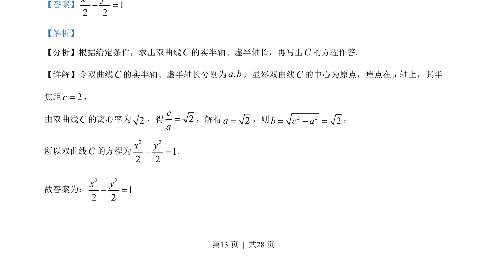

## 题面

## 摘要

已知双曲线焦点和离心率，求标准方程。

## 关联考点

- [[732-双曲线的标准方程|双曲线的标准方程]]
- [[391-椭圆离心率|离心率]]
- [[实半轴与虚半轴]]

## 答案与解析

> 📄 原 PDF 第 13 页：`素材/真题/北京/2008-2024·（北京）数学高考真题/2023年高考数学试卷（北京）（解析卷）.pdf`

<!-- 题干文本-start -->
## 题干文本
12. 已知双曲线 C的焦点为( 2,0)-和(2,0)，离心率为2，则 C的方程为____________．
<!-- 题干文本-end -->

<!-- 解析文本-start -->
## 解析文本
【答案】
2 212 2x y- =
【解析】
【分析】根据给定条件，求出双曲线C的实半轴、虚半轴长，再写出C的方程作答.
【详解】令双曲线C的实半轴、虚半轴长分别为,a b，显然双曲线C的中心为原点，焦点在 x 轴上，其半
焦距2c=，
由双曲线C的离心率为2，得2ca=，解得2a=，则 2 22b c a= - =，
所以双曲线C的方程为
2 212 2x y- =.
故答案为：
2 212 2x y- =
为
<!-- 解析文本-end -->
