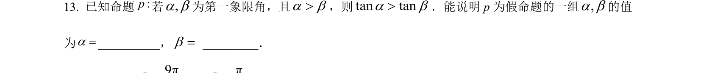
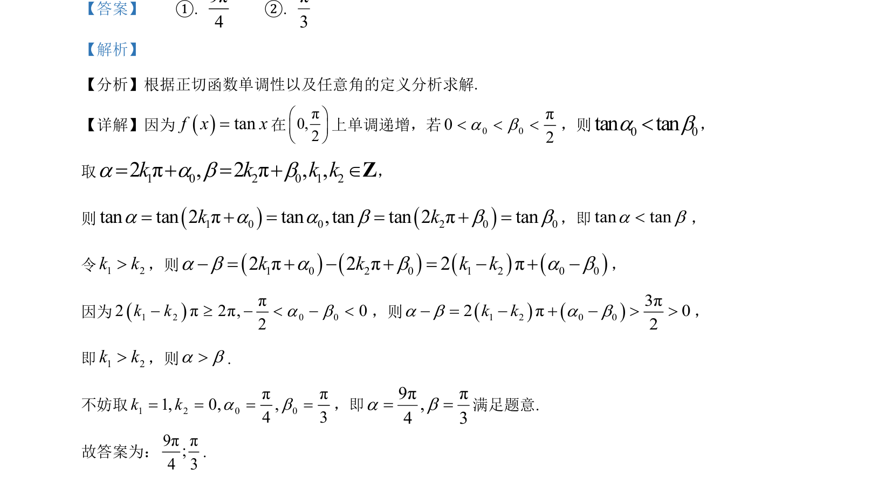

## 题面

## 摘要

考查正切函数单调性与任意角周期性，通过构造角度比较大小并求值

## 关联考点

- [[正切函数单调性]]
- [[275-任意角|任意角]]
- [[761-周期性|周期性]]

## 答案与解析

> 📄 原 PDF 第 14 页：`素材/真题/北京/2008-2024·（北京）数学高考真题/2023年高考数学试卷（北京）（解析卷）.pdf`

<!-- 题干文本-start -->
## 题干文本
13. 已知命题:p若,a b为第一象限角，且a b>，则tan tana b>．能说明 p 为假命题的一组,a b的值
为a=__________，b= _________．
<!-- 题干文本-end -->

<!-- 解析文本-start -->
## 解析文本
【答案】    ①. 9π4
    ②. π3
【解析】
【分析】根据正切函数单调性以及任意角的定义分析求解.
【详解】因为tanf x x=在π0,2æ öç ÷è ø上单调递增，若 0 0π02< < <a b，则0 0tan tan<a b，
取 1 0 2 0 1 22π, 2π, ,k k k k= + = + ÎZa a b b，
则1 0 0 2 0 0tan tan 2πtan ,tan tan 2πtank k= + = = + =a a a b b b，即tan tana b<，
令1 2k k>，则1 0 2 0 1 2 0 02π2π2πk k k k- = + - + = - + -a b a b a b，
因为1 2 0 0π2π2π, 02k k- ³ - < - <a b，则1 2 0 03π2π02k k- = - + - > >a b a b，
即1 2k k>，则a b>.
不妨取1 2 0 0ππ1, 0, ,4 3k k= = = =a b，即9ππ,4 3a b= =满足题意.
故答案为：9ππ;4 3.
<!-- 解析文本-end -->
