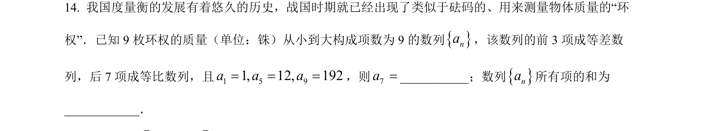
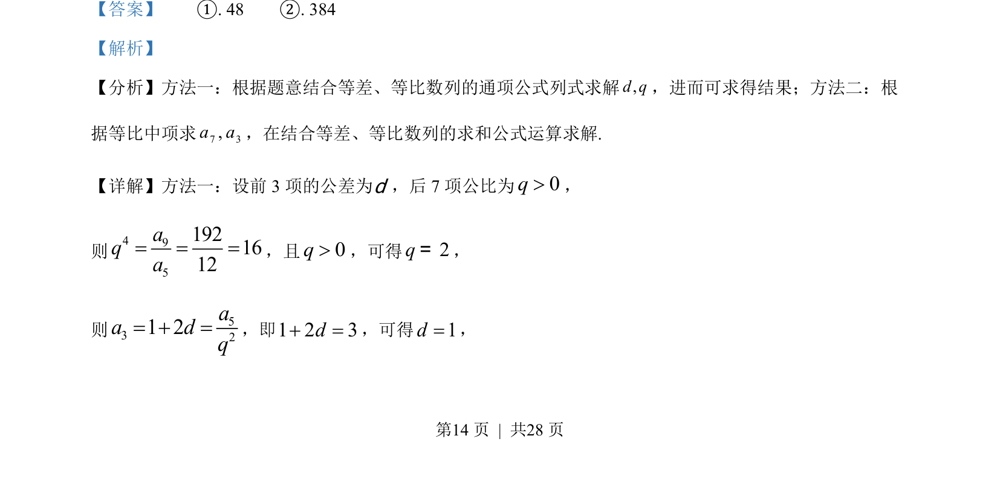
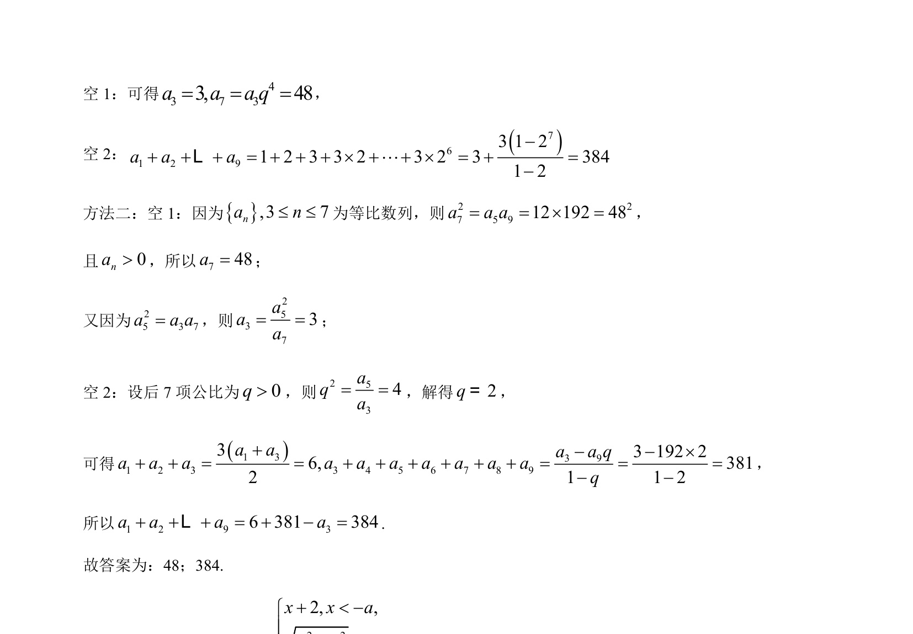

## 题面

## 摘要

考查等差数列和等比数列的通项公式、求和的综合应用

## 关联考点

- [[356-等差数列概念|等差数列]]
- [[1067-等比数列的定义与通项公式|等比数列]]
- [[384-数列通项公式|通项公式]]
- [[1081-累加求和|数列求和]]

## 答案与解析

> 📄 原 PDF 第 14 页：`素材/真题/北京/2008-2024·（北京）数学高考真题/2023年高考数学试卷（北京）（解析卷）.pdf`
