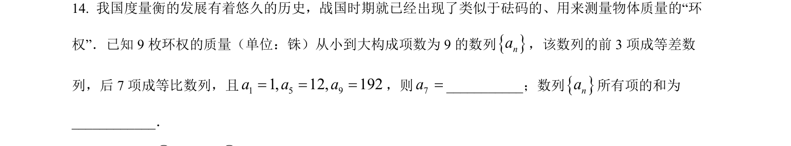
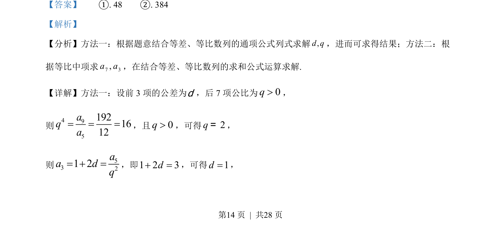
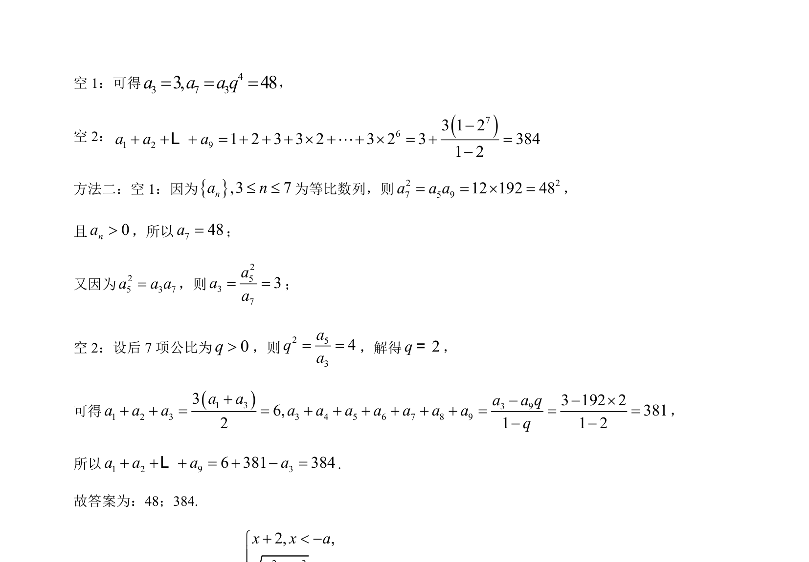

## 题面

## 摘要

考查等差数列和等比数列的通项公式、求和的综合应用

## 关联考点

- [[356-等差数列概念|等差数列]]
- [[1067-等比数列的定义与通项公式|等比数列]]
- [[384-数列通项公式|通项公式]]
- [[1081-累加求和|数列求和]]

## 答案与解析

> 📄 原 PDF 第 14 页：`素材/真题/北京/2008-2024·（北京）数学高考真题/2023年高考数学试卷（北京）（解析卷）.pdf`

<!-- 题干文本-start -->
## 题干文本
14. 我国度量衡的发展有着悠久的历史，战国时期就已经出现了类似于砝码的、用来测量物体质量的“环
权”．已知 9 枚环权的质量（单位：铢）从小到大构成项数为 9 的数列{}na，该数列的前 3 项成等差数
列，后 7 项成等比数列，且1 5 91, 12, 192a a a= = =，则7a=___________；数列{}na所有项的和为
____________．
<!-- 题干文本-end -->

<!-- 解析文本-start -->
## 解析文本
【答案】    ①. 48    ②. 384
【解析】
【分析】方法一：根据题意结合等差、等比数列的通项公式列式求解,d q，进而可求得结果；方法二：根
据等比中项求7 3,a a，在结合等差、等比数列的求和公式运算求解.
【详解】方法一：设前 3 项的公差为d，后 7 项公比为0q>，
则4951921612aqa= = =，且0q>，可得2q=，
则 5321 2aa dq= + =，即1 2 3d+ =，可得1d=，
<!-- 解析文本-end -->
