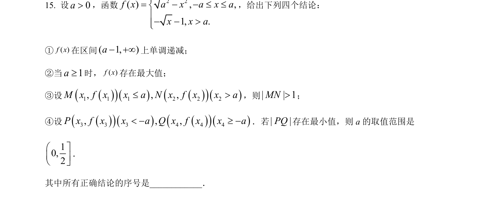
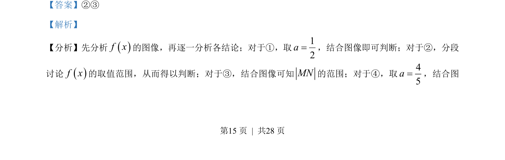
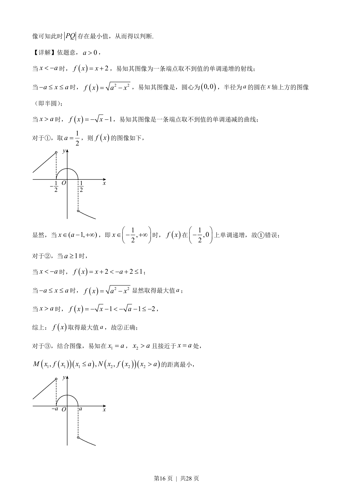
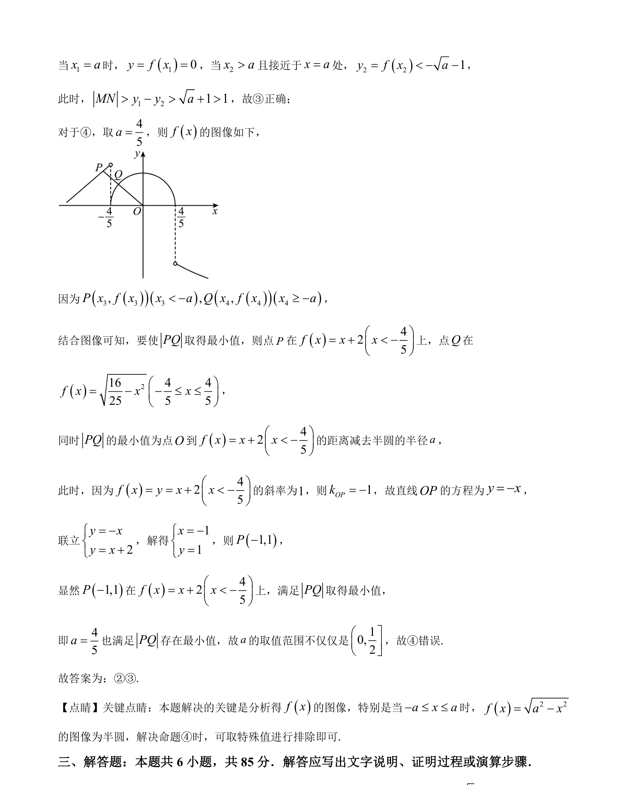

## 题面

## 摘要

考查含参数的分段函数图像与性质，结合数形结合判断相关结论。

## 关联考点

- [[290-分段函数|分段函数]]
- [[897-数形结合|数形结合]]
- [[含参讨论]]
- [[187-函数图象|函数图像]]

## 答案与解析

> 📄 原 PDF 第 15 页：`素材/真题/北京/2008-2024·（北京）数学高考真题/2023年高考数学试卷（北京）（解析卷）.pdf`
