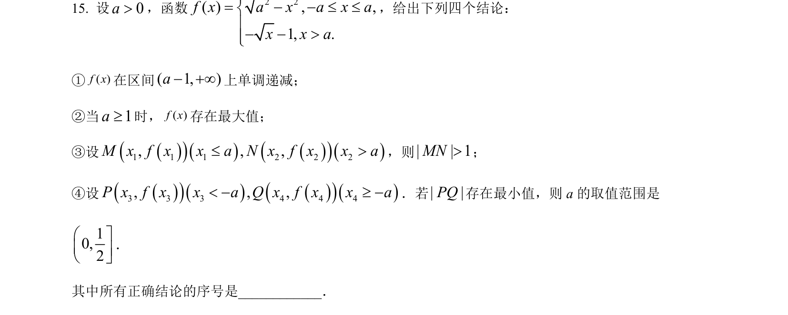
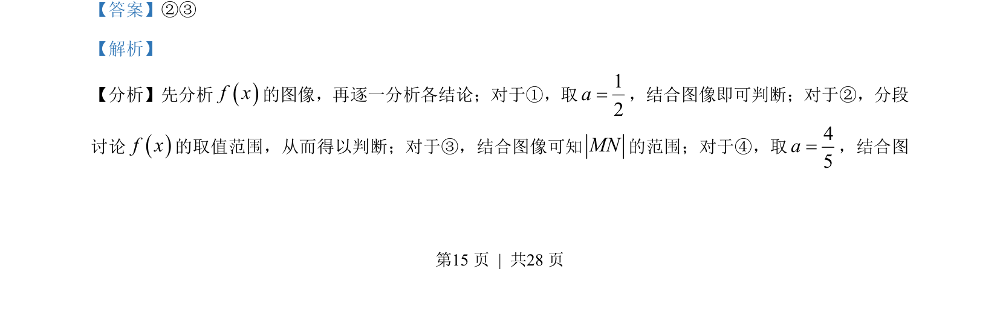
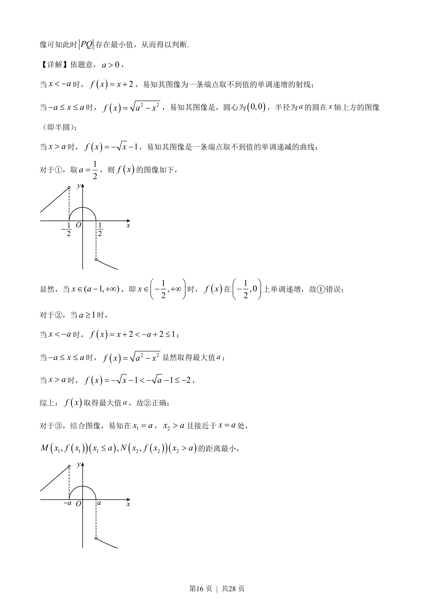
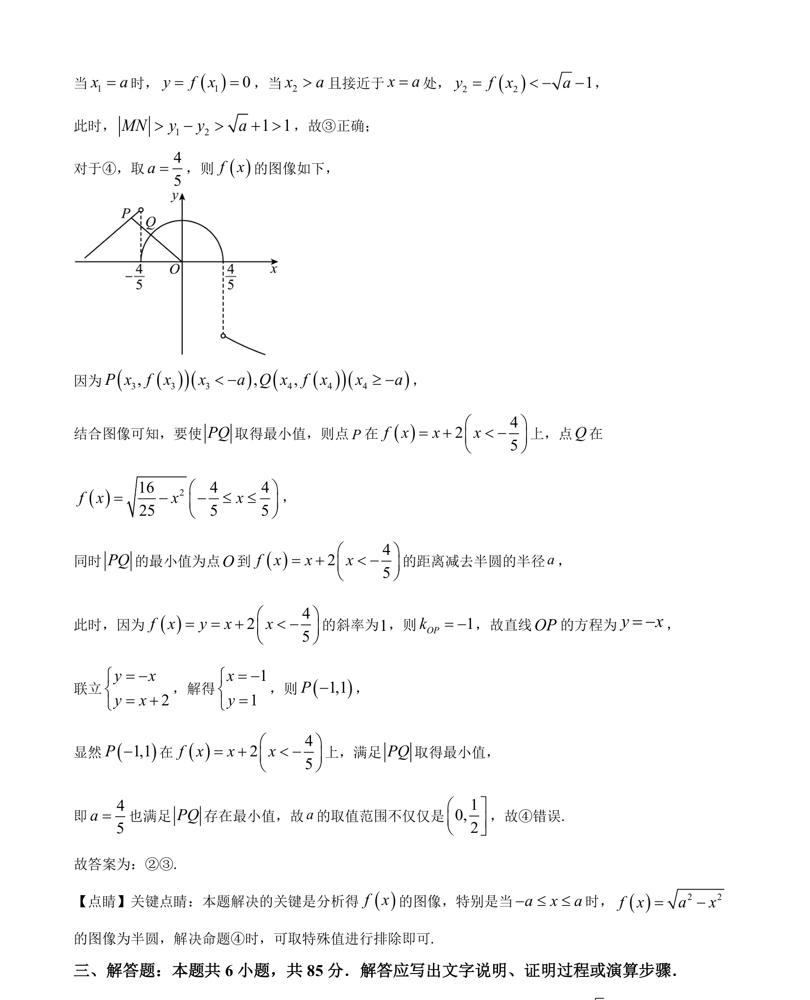

## 题面

## 摘要

考查含参数的分段函数图像与性质，结合数形结合判断相关结论。

## 关联考点

- [[290-分段函数|分段函数]]
- [[897-数形结合|数形结合]]
- [[含参讨论]]
- [[187-函数图象|函数图像]]

## 答案与解析

> 📄 原 PDF 第 15 页：`素材/真题/北京/2008-2024·（北京）数学高考真题/2023年高考数学试卷（北京）（解析卷）.pdf`

<!-- 题干文本-start -->
## 题干文本
15. 设0a>，函数 2 22, ,( ) , ,1, .x x af x a x a x ax x a+ < -ìïï= - - £ £íï- - >ïî
，给出下列四个结论：
①( )f x在区间( 1, )a- +¥上单调递减；
②当1a³时，( )f x存在最大值；
③设1 1 1 2 2 2, , ,M x f x x a N x f x x a£ >，则| | 1MN>；
④设3 3 3 4 4 4, , ,P x f x x a Q x f x x a< - ³ -．若| |PQ存在最小值，则 a 的取值范围是
10,2æ ùçúè û
．
其中所有正确结论的序号是____________．
<!-- 题干文本-end -->

<!-- 解析文本-start -->
## 解析文本
【答案】②③
【解析】
【分析】先分析f x的图像，再逐一分析各结论；对于①，取12a=，结合图像即可判断；对于②，分段
讨论f x的取值范围，从而得以判断；对于③，结合图像可知MN的范围；对于④，取45a=，结合图
<!-- 解析文本-end -->
