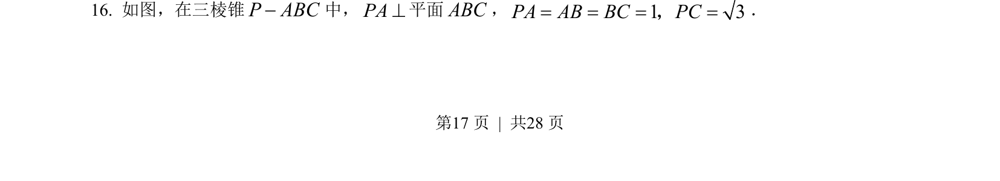
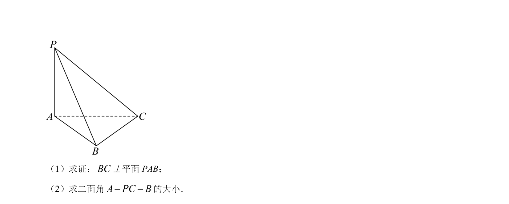
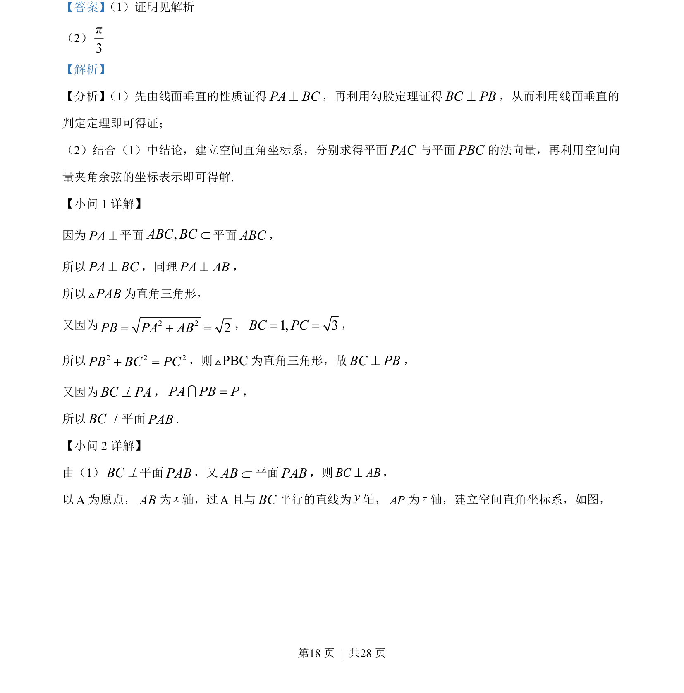
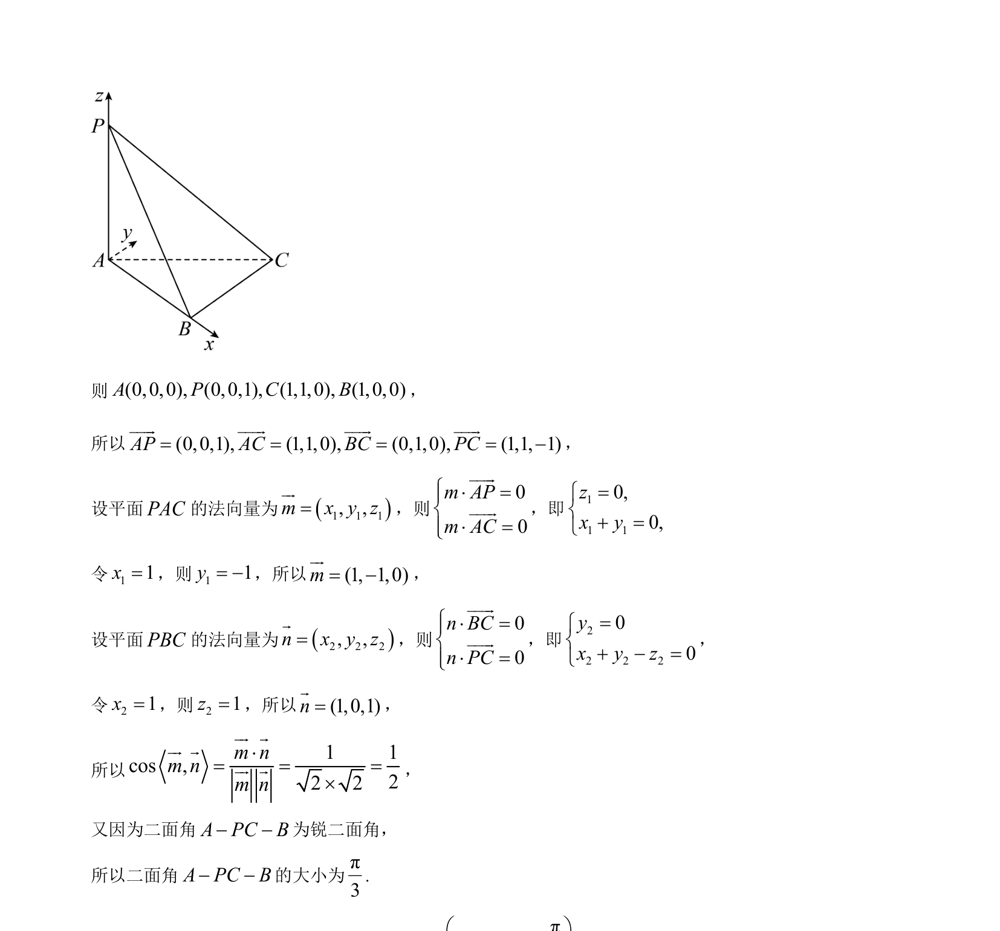

## 题面

## 摘要

本题主要考查线面垂直的判定与性质，并利用空间向量求二面角的余弦值。

## 关联考点

- [[1087-线面垂直的判定与性质|线面垂直的判定与性质]]
- [[空间向量法求二面角]]
- [[空间直角坐标系建立]]
- [[法向量求解]]

## 答案与解析

> 📄 原 PDF 第 17 页：`素材/真题/北京/2008-2024·（北京）数学高考真题/2023年高考数学试卷（北京）（解析卷）.pdf`
