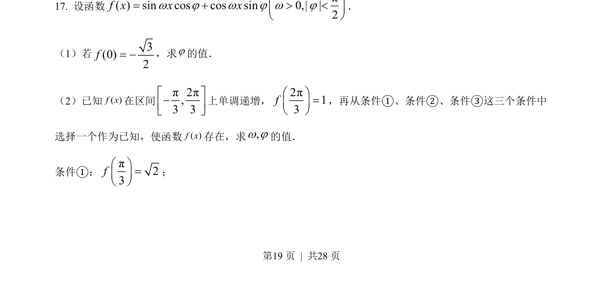
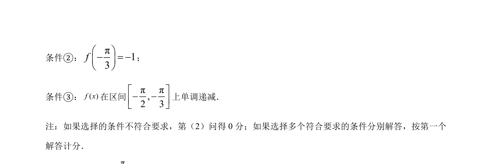
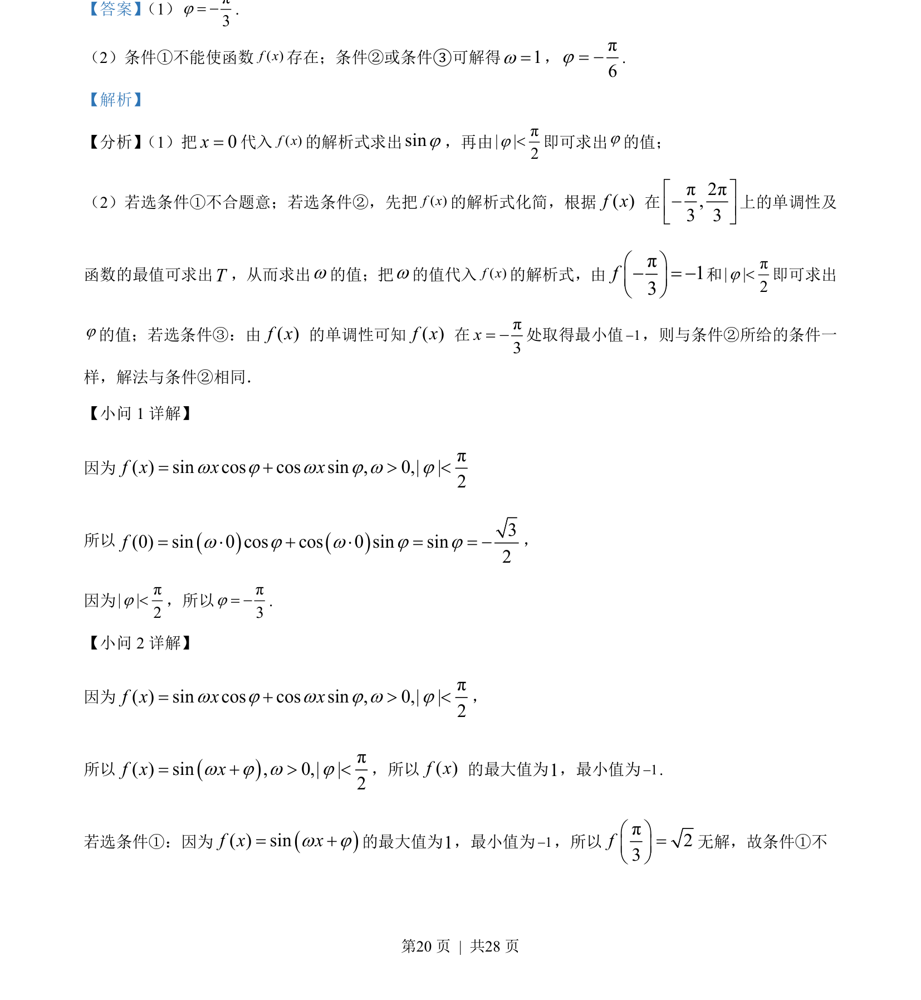
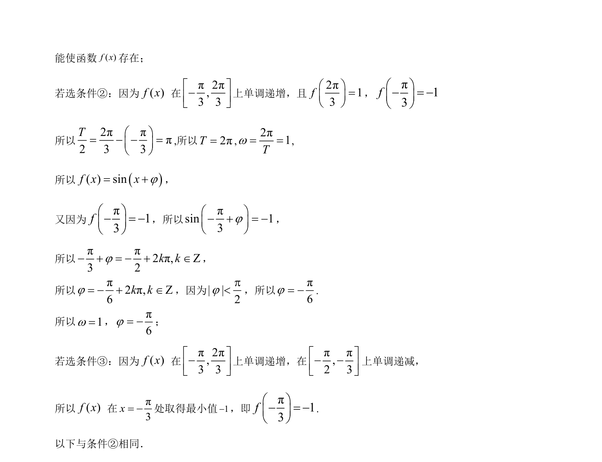

## 题面

## 摘要

已知函数解析式求参数，利用函数最值和单调性确定解析式。

## 关联考点

- [[三角函数求解析式]]
- [[正弦型函数性质]]
- [[719-单调性|单调性]]
- [[286-函数的最值|最值]]

## 答案与解析

> 📄 原 PDF 第 19 页：`素材/真题/北京/2008-2024·（北京）数学高考真题/2023年高考数学试卷（北京）（解析卷）.pdf`
