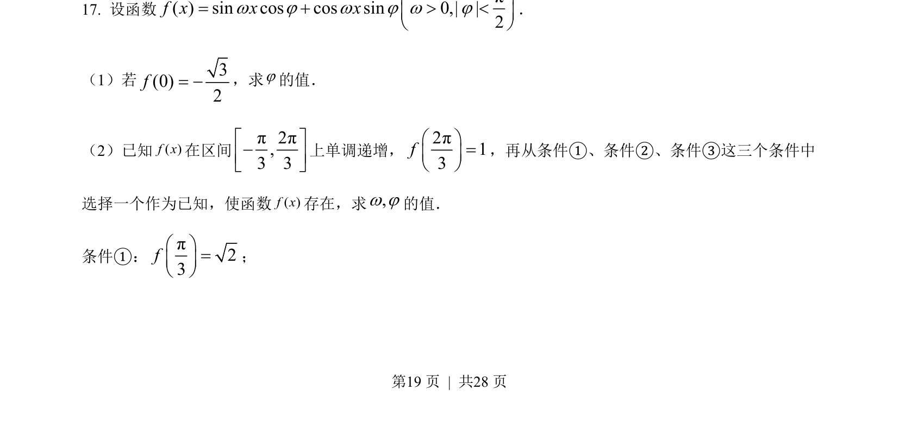
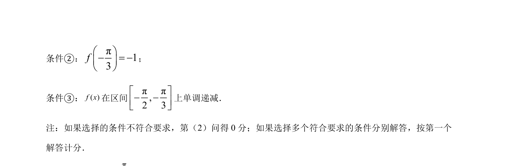
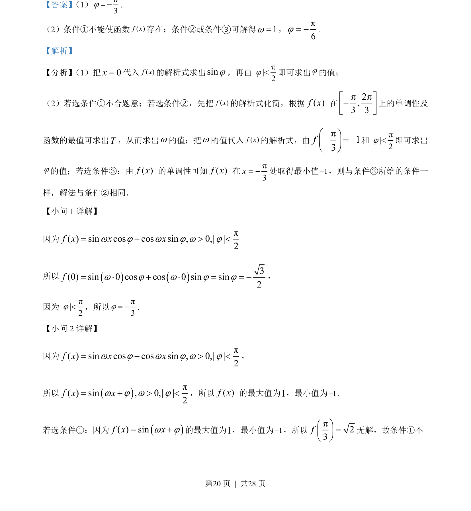
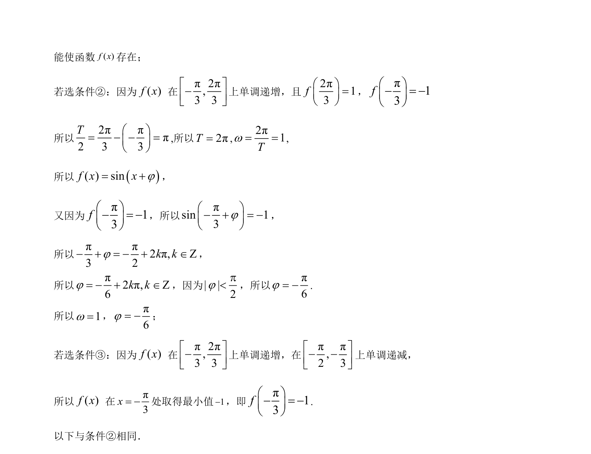

## 题面

## 摘要

已知函数解析式求参数，利用函数最值和单调性确定解析式。

## 关联考点

- [[三角函数求解析式]]
- [[正弦型函数性质]]
- [[719-单调性|单调性]]
- [[286-函数的最值|最值]]

## 答案与解析

> 📄 原 PDF 第 19 页：`素材/真题/北京/2008-2024·（北京）数学高考真题/2023年高考数学试卷（北京）（解析卷）.pdf`

<!-- 题干文本-start -->
## 题干文本
17. 设函数 π( ) sin cos cos sin 0,| |2f x x xw j w j w jæ ö= + > <ç ÷è ø
．
（1）若 3(0)2f= -，求j的值．
（2）已知( )f x在区间π2π,3 3-é ùê úë û
上单调递增，2π13fæ ö=ç ÷è ø
，再从条件①、条件②、条件③这三个条件中
选择一个作为已知，使函数( )f x存在，求,w j的值．
条件①：π23fæ ö=ç ÷è ø
；
<!-- 题干文本-end -->

<!-- 解析文本-start -->
## 解析文本

<!-- 解析文本-end -->
