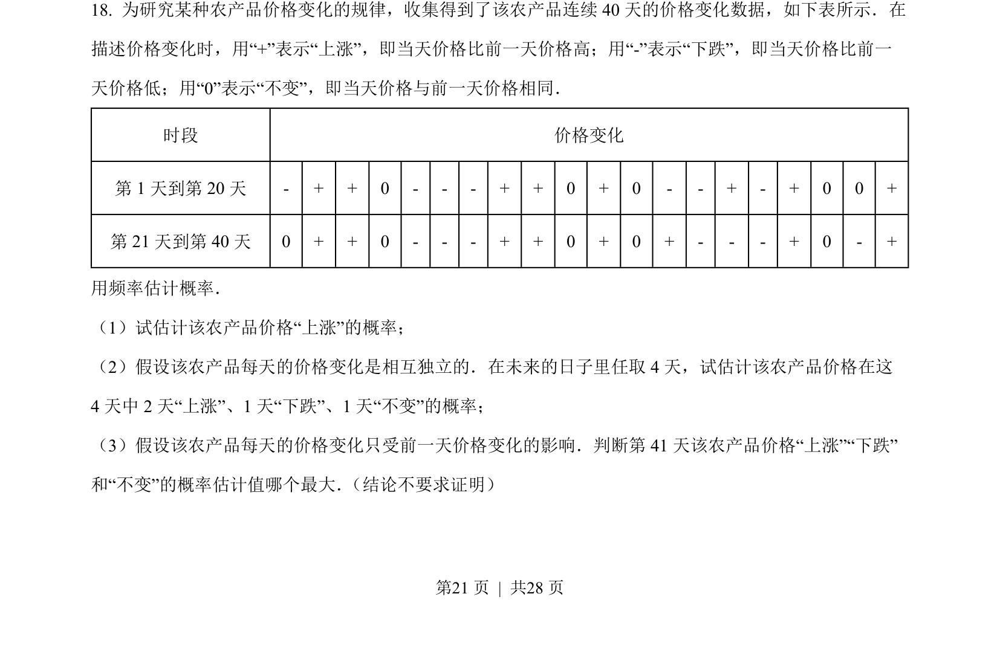
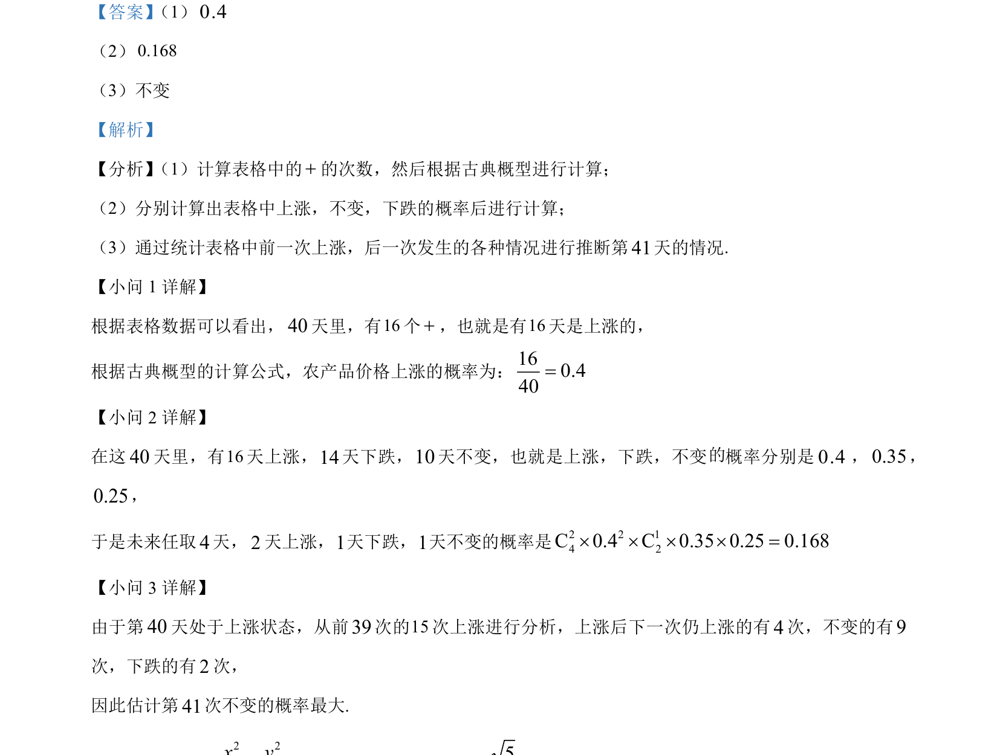

## 题面

## 摘要

考查古典概型计算概率、频率估计概率及统计推断。

## 关联考点

- [[320-古典概型|古典概型]]
- [[949-概率计算|概率计算]]
- [[1188-频率估计概率|频率估计概率]]
- [[508-统计推断|统计推断]]

## 答案与解析

> 📄 原 PDF 第 21 页：`素材/真题/北京/2008-2024·（北京）数学高考真题/2023年高考数学试卷（北京）（解析卷）.pdf`
