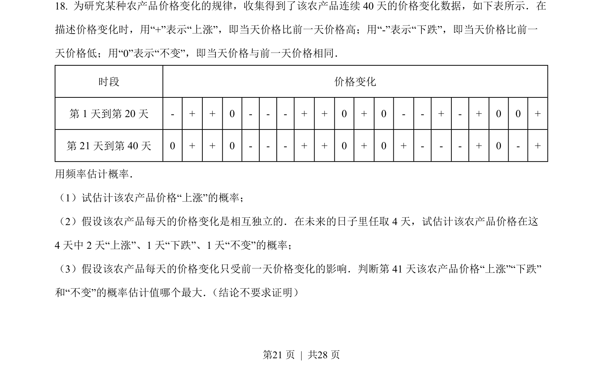
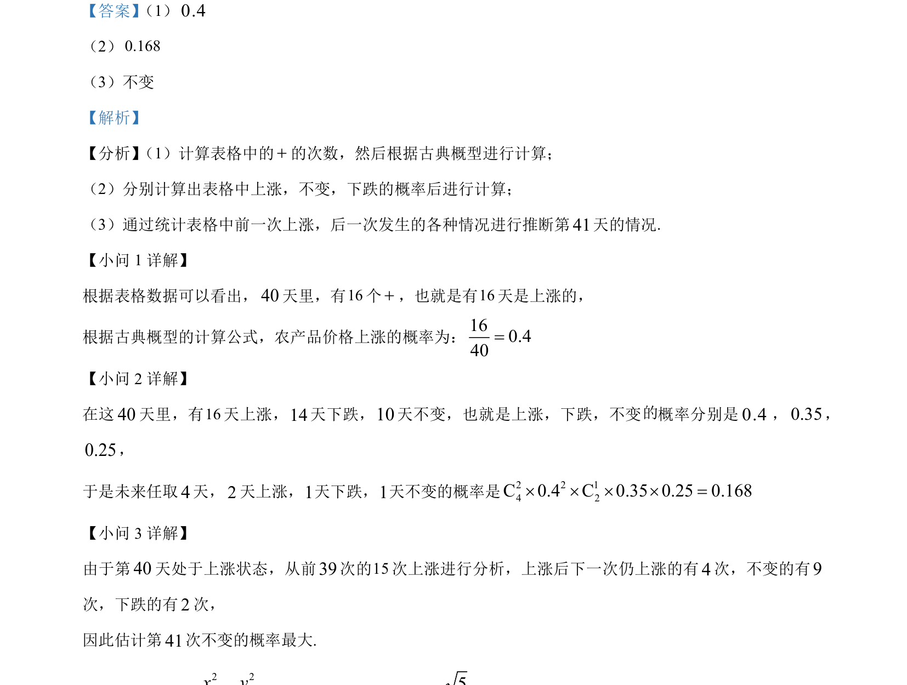

## 题面

## 摘要

考查古典概型计算概率、频率估计概率及统计推断。

## 关联考点

- [[320-古典概型|古典概型]]
- [[948-概率计算|概率计算]]
- [[1187-频率估计概率|频率估计概率]]
- [[508-统计推断|统计推断]]

## 答案与解析

> 📄 原 PDF 第 21 页：`素材/真题/北京/2008-2024·（北京）数学高考真题/2023年高考数学试卷（北京）（解析卷）.pdf`

<!-- 题干文本-start -->
## 题干文本
18. 为研究某种农产品价格变化的规律，收集得到了该农产品连续 40 天的价格变化数据，如下表所示．在
描述价格变化时，用“+”表示“上涨”，即当天价格比前一天价格高；用“-”表示“下跌”，即当天价格比前一
天价格低；用“0”表示“不变”，即当天价格与前一天价格相同．
时段 价格变化
第 1 天到第 20 天 - + + 0 - - - + + 0 + 0 - - + - + 0 0 +
第 21 天到第 40 天 0 + + 0 - - - + + 0 + 0 + - - - + 0 - +
用频率估计概率．
（1）试估计该农产品价格“上涨”的概率；
（2）假设该农产品每天的价格变化是相互独立的．在未来的日子里任取 4 天，试估计该农产品价格在这
4 天中 2 天“上涨”、1 天“下跌”、1 天“不变”的概率；
（3）假设该农产品每天的价格变化只受前一天价格变化的影响．判断第 41 天该农产品价格“上涨”“下跌”
和“不变”的概率估计值哪个最大． （结论不要求证明）
<!-- 题干文本-end -->

<!-- 解析文本-start -->
## 解析文本

<!-- 解析文本-end -->
