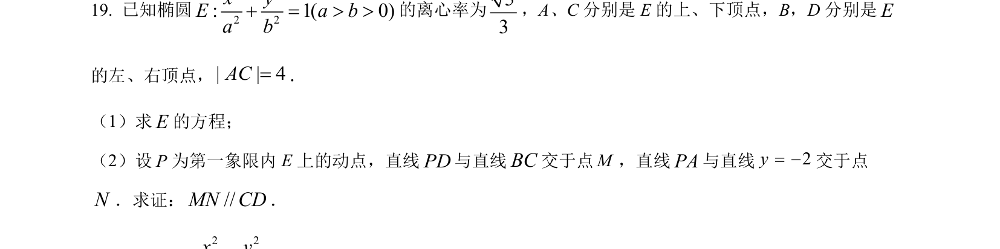
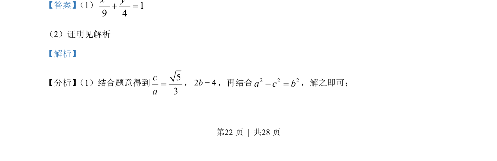
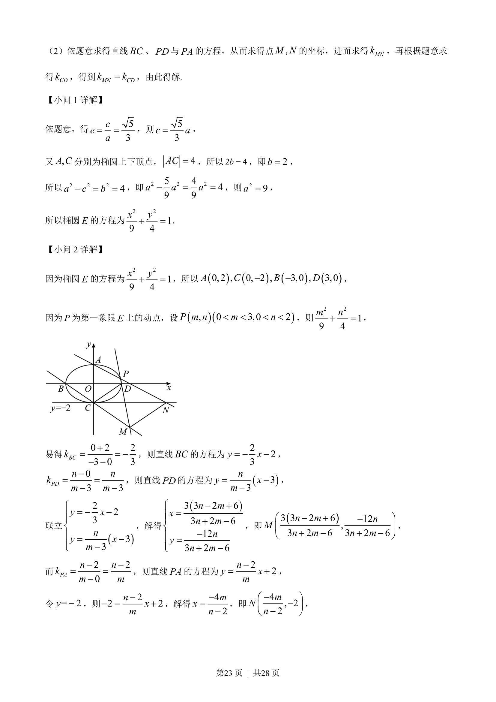
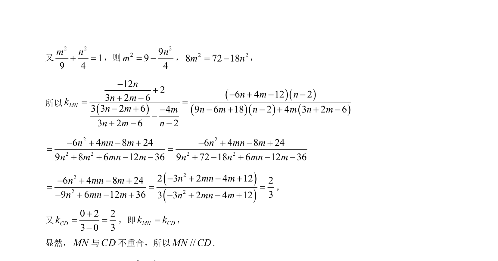

## 题面

## 摘要

椭圆方程求解及直线与椭圆交点坐标、斜率关系证明。

## 关联考点

- [[061-方程|椭圆的标准方程]]
- [[391-椭圆离心率|离心率]]
- [[1026-直线方程|直线方程]]
- [[1216-斜率计算|斜率计算]]

## 答案与解析

> 📄 原 PDF 第 22 页：`素材/真题/北京/2008-2024·（北京）数学高考真题/2023年高考数学试卷（北京）（解析卷）.pdf`
