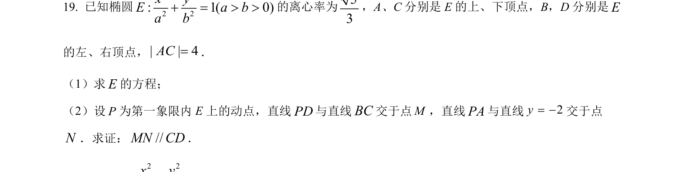
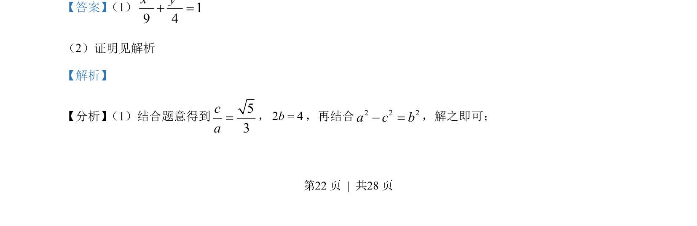
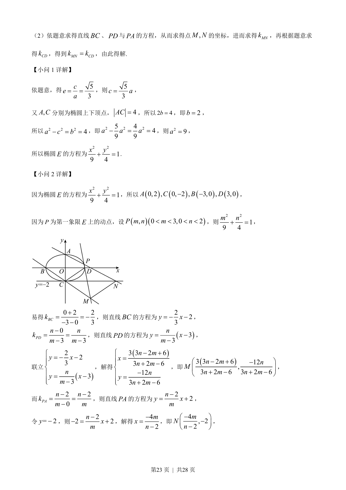
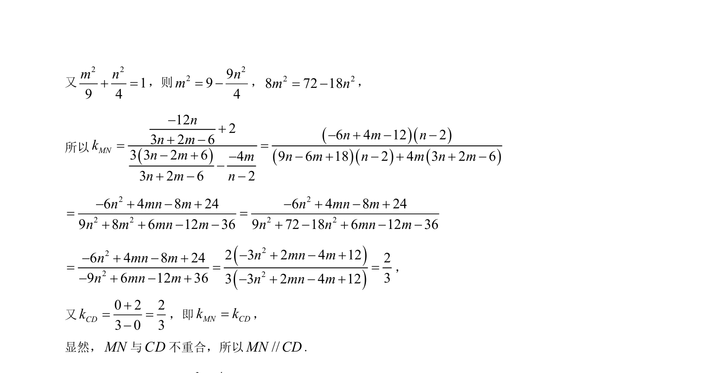

## 题面

## 摘要

椭圆方程求解及直线与椭圆交点坐标、斜率关系证明。

## 关联考点

- [[061-方程|椭圆的标准方程]]
- [[391-椭圆离心率|离心率]]
- [[1026-直线方程|直线方程]]
- [[1216-斜率计算|斜率计算]]

## 答案与解析

> 📄 原 PDF 第 22 页：`素材/真题/北京/2008-2024·（北京）数学高考真题/2023年高考数学试卷（北京）（解析卷）.pdf`

<!-- 题干文本-start -->
## 题干文本
19. 已知椭圆
2 22 2: 1( 0)x yE a ba b+ = > >的离心率为53
，A、C分别是 E的上、下顶点，B，D 分别是E
的左、右顶点，| | 4AC=．
（1）求E的方程；
（2）设P为第一象限内 E上的动点，直线PD与直线BC交于点M，直线PA与直线2y= -交于点
N．求证：//MN CD．
<!-- 题干文本-end -->

<!-- 解析文本-start -->
## 解析文本
【答案】 （1）
2 219 4x y+ =    
（2）证明见解析
【解析】
【分析】 （1）结合题意得到53ca=，2 4b=，再结合2 2 2a c b- =，解之即可；
的
<!-- 解析文本-end -->
